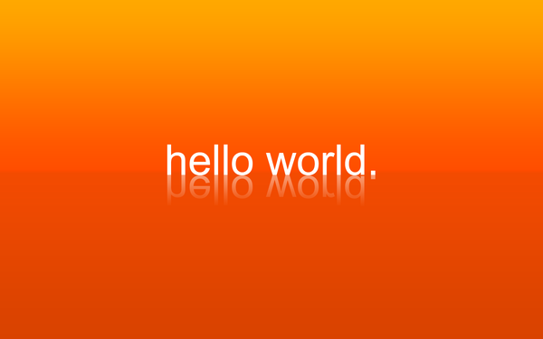

# Start programming

I don’t know exactly how I ended up where I am. I mean, programming, and lovin’ it. Even if I’m not so good.

I’ve heard a thousand of guys telling stories like: “When I was twelve my parents bought me my first computer and I started learning on my own.” or “I won a programming contest when I was in highschool”. Great. Well done. I’ve never noticed about what coding was until I was eighteen, when I had to decide what to study at the University.

Do you want to know what was I thinking about? First option: Computer Science. Second option: Arts (wtf?). Third option: Philosophy (WTF?). I’ve ever liked computers, yes, but I’d never thought I could do that amazing things with them. I also liked maths, puzzles, things that made my brain think hard and get fun at the same time. You know, quizes, enigmas, games… The conclusion was that I wanted to do something creative, where I could put my imagination on, where I could challenge myself in order to create new stuff.

My first programming class was awful. I didn’t get nothing, and everyone seemed to be so cool on it, everyone with this big “Hello World” in their screens and a smile in their faces like ‘Yeah dude, I did it.”. I didn’t even know what to write down, or what was the teacher talking about. I was so frustrated, my first exam was… well, I don’t want to talk about my first exam.

One day, I don’t know how, something changed. Suddenly, I realized what programming was. I really abstracted my mind, I looked at it from another perspective, and it came with me so clear and so beautiful and I can not explain with words what I felt.

Was it easier from then? Not at all. In fact, I left Computer Science after the first year, with almost all the subjects passed, because there was still something that made me think I was not made for it. I was so lost, I didn’t know what to do with my life. I really liked programming, but there were so much thinks that seemed to be so far away from me. And I felt that everyone around me was going good on it, it was so frustrating that I couldn’t stand it anymore.

Then, I decided I had to change my situation because there should be something out there waiting for me. I looked for other degrees in a lot of universities. 

It was. I do really love what I’m studying now, but the truth is that I think I’ve found my way. Actually, I will finish also Computer Science someday, but in a different place. And I’m still getting frustrated, of course, who doesn’t?, but I know I learned to love that frustration. Let me explain myself.

Programming is that. Is try it out thousand of times. Is try to find a mistake between a million lines of code, it’s to abstract your mind to find an answer, it’s… beautiful. I know really good programmers that honestly, I think I’ll never reach out, I have not that brilliant brain. But I keep on trying it, I’m not the best, I just love what I do.

Maybe this post is not just about programming, maybe is more about to find out what do you really love. Even if sometimes you hate it, or it makes you cry, or it makes you feel so stupid because you are not able to understand it, or if it makes you think there is a lot of people smarter than you doing the same thing better. Just… enjoy your time, fight for what you want, challenge yourself to go to the next step.
