# Architecture overview Microsoft Dynamics AX 2012

> Understanding the internal architecture of Microsoft Dynamics AX 2012 can help you make decision when planning and developing a Microsoft Dynamics AX 2012 system. Here are some pointers on DAX 2012 architecture primarily for DAX 2012 architects & solution developers. This topic provides a high-level overview of the system architecture of Microsoft Dynamics AX.

## System architecture

This diagram provides a high-level over of a Microsoft Dynamics AX 2012 system with all components installed, and describes how communications flow between the components.

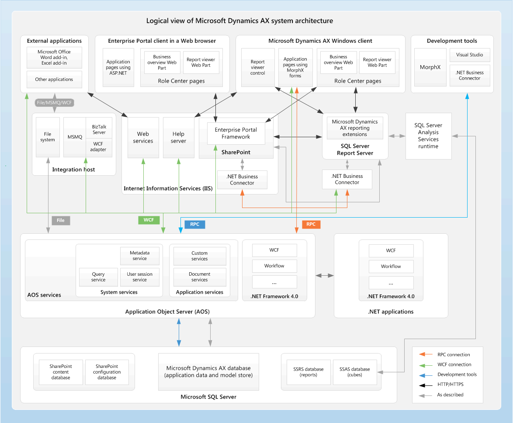

### 1. Application Object Server (AOS) architecture

This diagram describes the functionality within the AOS Windows service, and describes how communications flow within it.

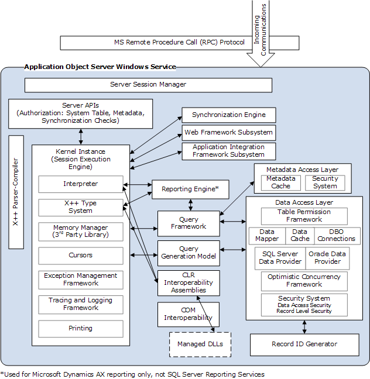

**Note**: Clients communicate with an AOS by using remote procedure calls (RPCs), Windows Communication Foundation (WCF), or AOS services. In previous releases, other components and third-party programs could communicate with an AOS by using either .NET Business Connector or Application Integration Framework (AIF). For this release, we recommend that third-party programs use AOS services to communicate with AOS.

### 2. Business Connector architecture

The differences between the client kernel as it runs on a standard client and a Business Connector client are:

* The Session Manager in the client kernel manages only a single instance–in the Business Connector kernel, it manages multiple instances.

* he client kernel includes forms security, while the Business Connector kernel does not.

This diagram describes the architecture of the Business Connector version of the client kernel, and describes how communications flow within it.

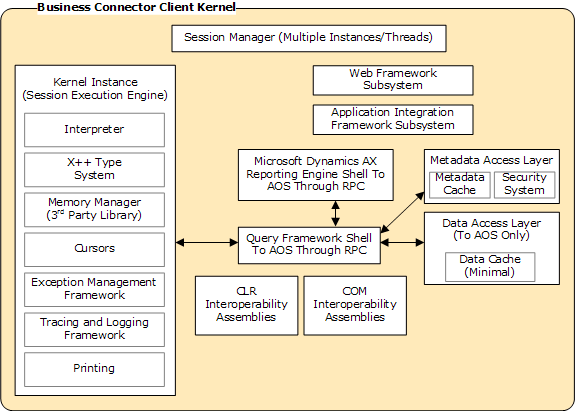

### 3. Application file server architecture

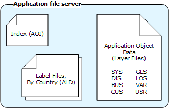

## Model store architecture

Microsoft Dynamics AX contains sixteen layers. Each layer consists of one or more logical parts called models. A model is generated for each layer. For example, VAR Model is the model that the system generates for the VAR layer. The system generated models let you install and work with the base Microsoft Dynamics AX system.

When you customize the Microsoft Dynamics AX program, you can take advantage of the capabilities of models.

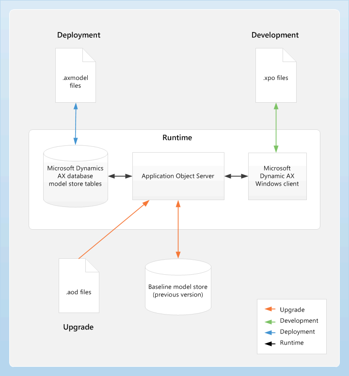

The following table describes the application object layers in Microsoft Dynamics AX 2012:

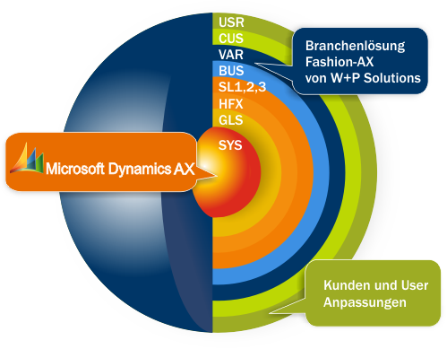

## Client architecture

This diagram describes the functionality within the client, and describes how communications flow within it.

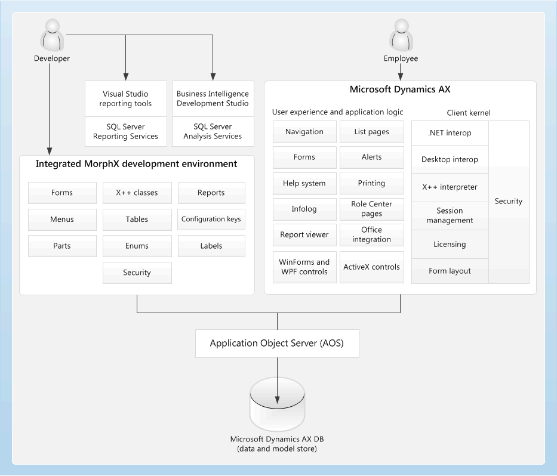

## Client/server communication

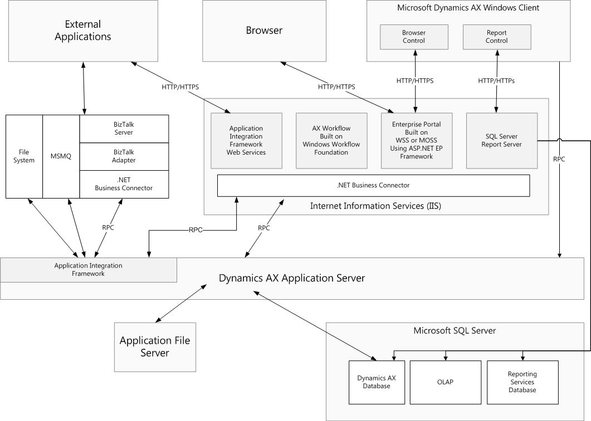

The client communicates with various Microsoft Dynamics AX components in the following ways:

* The client uses the remote procedure call (RPC) protocol to communicate with Application Object Server (AOS). The client never accesses the database or metadata directly. AOS sends the application objects and data to the client.

* The data layer that the client uses is based on data sources that are specified in metadata for forms and queries. In addition, any X++ code that is required to retrieve data can use the built-in language support to query and adjust data.

* The client uses a report Web Part to interact with the report server. By calling the web services that are exposed by the report server, the report control in the Web Part displays information that is contained in Reporting Services reports. These reports can include either transnational data from the Microsoft Dynamics AX application or OLAP cubes from Microsoft SQL Server Analysis Services. Cubes provide business analytic and key performance indicators (KPIs).

* The client provides workflow forms, alerts, and controls so that users can participate in the business process by using the Workflow system. The Workflow system is a Microsoft Dynamics AX component that enables workflow processes by using Windows Communication Foundation classes.

* The client provides a Help viewer, which is an application that displays context-sensitive Help topics. The Help topics are retrieved from a Help server that is located on-premises.

* The client also provides Role Centers, or role-based home pages, for users. Role Centers provide role-specific tasks, activities, alerts, reports, and business intelligence that help users increase their productivity. To interact with the Role Centers that are provided by Enterprise Portal and hosted on Internet Information Services (IIS), the client uses a browser control.

## Services and AIF architecture

> AX 2012 exposes its functionality through services that are based on Windows Communication Foundation (WCF) and hosted on Application Object Server (AOS). External applications and client applications on the local area network consume AX services by accessing them directly from AOS.

* These clients and applications include AX components such as the AX client, Office Add-, and Enterprise Portal.

* Internet-based external applications and clients access the AX services through Internet Information Services (IIS). IIS routes the incoming requests for AX services to AOS. All services requests, regardless of their origin, are handled by the WCF runtime that is hosted on AOS.

* The AIF request preprocessor, if it is configured, can intercept the inbound request messages for custom preprocessing, such as message transforms or value substitutions. The AX service invokes the necessary business logic to process the inbound request message.

* Similarly, the AIF response postprocessor, if it is configured, can intercept the outbound response messages for custom post-processing, such as message transforms or value substitutions. The AIF response postprocessor then returns the response to the client.

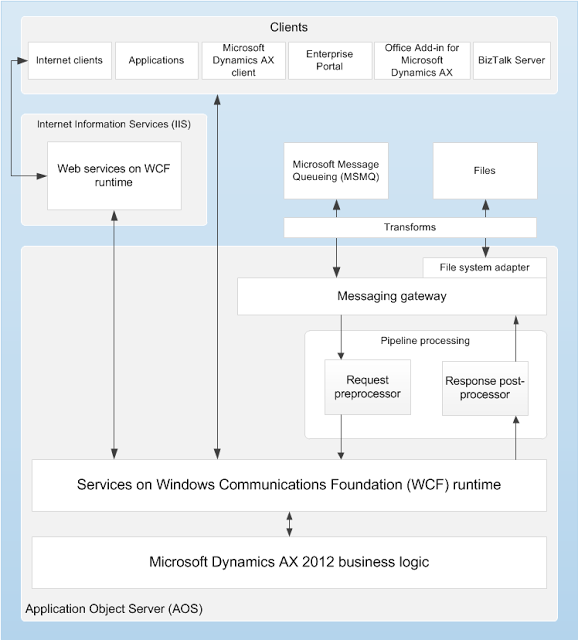

## Enterprise Portal architecture

This diagram provides a logical overview of a Microsoft Dynamics AX 2012 system with an Enterprise Portal server, and also describes the various components of the Enterprise Portal architecture.

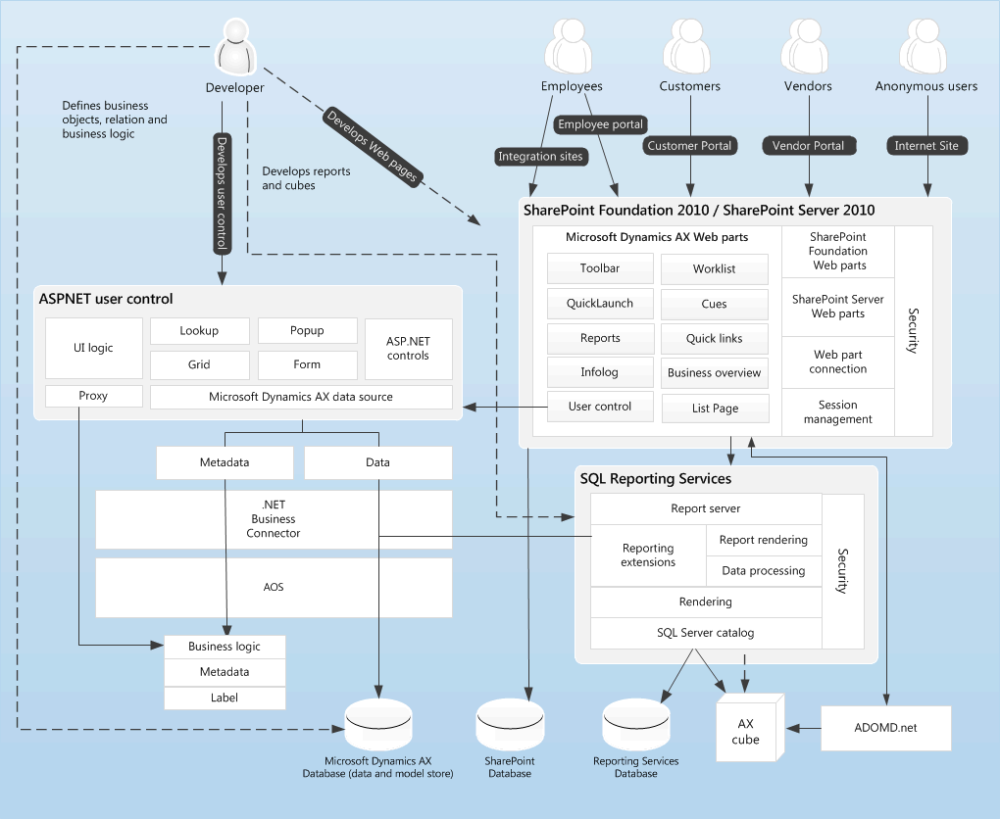

## Security architecture

This following diagram provides a high-level overview of the security architecture of Microsoft Dynamics AX 2012.

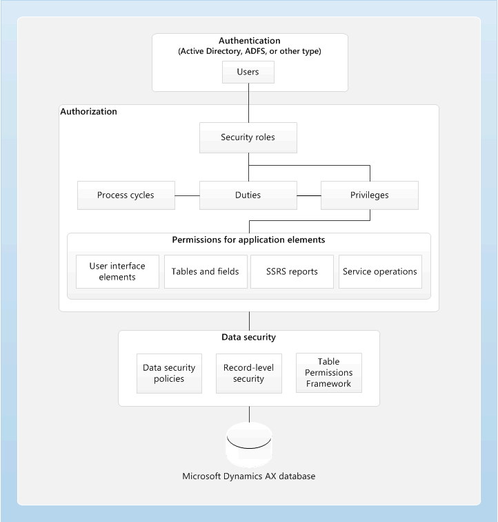

## Workflow system architecture

* This following diagram provides a high-level architecture of the workflow infrastructure.

* The workflow infrastructure consists of two components that are hosted on Application Object Server (AOS): the X++ workflow run-time and the managed workflow run-time.

.gif)

## Analytic architecture

The following diagram shows the Microsoft SQL Server Analysis Services cubes that are included with Microsoft Dynamics AX, and the components that are used to access them.

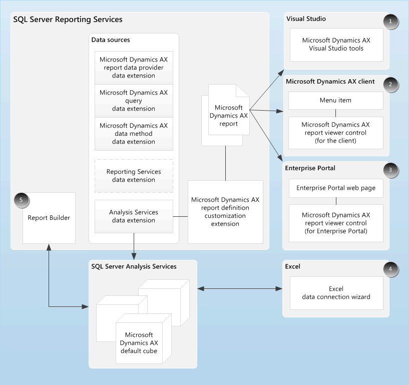

## Reporting architecture

The following diagram illustrates the architecture of the reporting functionality in Microsoft Dynamics AX.

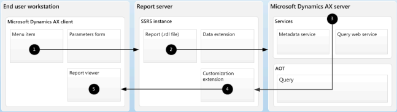

Thank you for reading.
