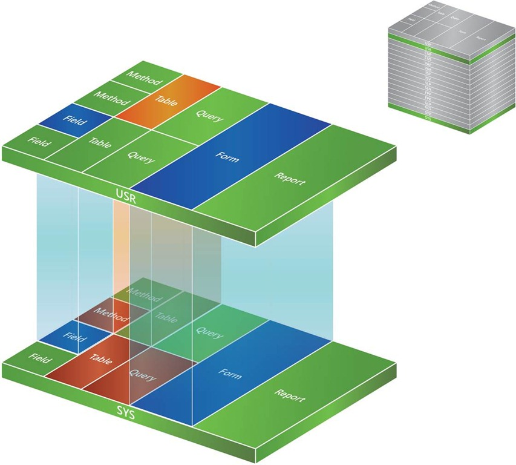
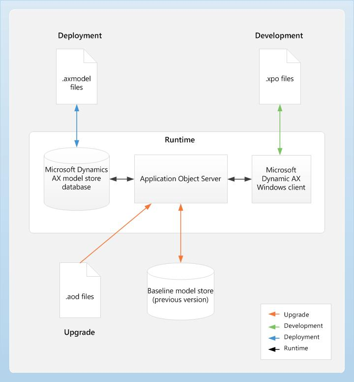

# Understand model store architectural in AX 2012

The model store is the portion of the Microsoft Dynamics AX database where all Microsoft Dynamics AX application elements are stored, including customization. **The model store replaces the AOD (application object definition)** files used in previous releases of Microsoft Dynamics AX (I mean from 4.0 to 2009).

**Layer and model information are integral parts of the store**. The AOS has access to the model store, handles layer-flattening, and provides model data to all the Microsoft Dynamics AX sub-systems, such as form- and report-rendering and X++ code.

Microsoft Dynamics AX contains sixteen layers. Each layer consists of one or more logical parts called models. A system generated model exists for each layer.

For example, the VAR Model is the system generated model for the VAR layer. You can use the system generated models to install and start working with the base Microsoft Dynamics AX system. You can leverage the capabilities of models, and tools and functionality that support the models, during customization of the Microsoft Dynamics AX application.

* The model store is the portion of the Microsoft Dynamics AX database where all Microsoft Dynamics AX application elements are stored, including customization.

* The model store replaces the AOD files used in previous releases of Microsoft Dynamics AX. It can be managed through the AXUtil command line utility, or by using Windows PowerShell.

* The baseline model store database holds model store tables for the previous version of metadata. Use it only during an upgrade.

* The baseline model store is similar to the old folder in previous releases of Microsoft Dynamics AX.

Thank you for reading.
