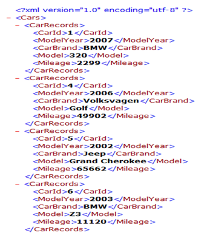
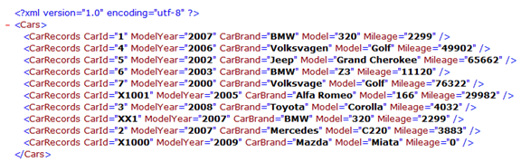

# Create and write to XML file in Dynamics AX

In this post let's explore creating XML using X++ code in Dynamics AX. 

The following example shows how to create and write data to an XML file by using the `XmlDocument`, `XmlElement`, and `XmlWriter` classes. It loops through all of the records in the `CarTable` and find all the fields in the table automatically by using the `DictTable` and `DictField` classes.

```C#
static void WriteXml(Args _args)
{

    XmlDocument xmlDoc;
    XmlElement xmlRoot;
    XmlElement xmlField;
    XmlElement xmlRecord;
    XMLWriter xmlWriter;

    CarTable carTable;
    DictTable dTable = new DictTable(tablenum(CarTable));
    DictField dField;
    int i, fieldId;
    str value;
    ; 

    #CarsXmlTags 

    // Create a new object of the XmlDocument class
    xmlDoc = XmlDocument::newBlank();

    // Create the root node
    xmlRoot = xmlDoc.createElement(#CarRootNode);

    // Loop through all the records in the carTable
    while select carTable
    {
        // Create a XmlElement (record) to hold the
        // contents of the current record.
        xmlRecord = xmlDoc.createElement(#CarRecords);
        // Loop through all the fields in the record

        for (i=1; i<=dTable.fieldCnt(); i++)
        {
            // Get the fieldId from the field-count
            fieldId = dTable.fieldCnt2Id(i);
            
            // Find the DictField object that matches the fieldId
            dField = dTable.fieldObject(fieldId);
            
            // Skip system fields
            if (dField.isSystem())
            continue;

            // Create a new XmlElement (field) and
            // have the name equal to the name of the
            // dictField
            xmlField = xmlDoc.createElement(dField.name());
            
            // Convert values to string. I have just added
            // a couple of conversion as an example.
            // Use tableName.(fieldId) instead of fieldname
            // to get the content of the field.
            switch (dField.baseType())
            {
                case Types::Int64 :
                    value = int642str(carTable.(fieldId));
                break;
                case Types::Integer :
                    value = int2str(carTable.(fieldId));
                break;
                default :
                    value = carTable.(fieldId);
                break;
            }

            // Set the innerText of the XmlElement (field)
            // to the value from the table
            xmlField.innerText(value);
             
            // Append the field as a child node to the record
            xmlRecord.appendChild(xmlField);
        }
         // Add the record as a child node to the root
        xmlRoot.appendChild(xmlRecord);
    }
    // Add the root to the XmlDocument
    xmlDoc.appendChild(xmlRoot);
    // Create a new object of the XmlWriter class
    // in order to be able to write the xml to a file
    xmlWriter = XMLWriter::newFile(@"c:tempcars.xml");
    // Write the content of the XmlDocument to the
    // file as specified by the XmlWriter
    xmlDoc.writeTo(xmlWriter);
}
```

The file that is created looks like the one in the following screenshot(only first part of the file is shown):



As you can see, this file is based on a standard XML format with tags and values only. You can, however, use tag attributes as well. To put the values from the table into tag attributes instead of their own tags, simply change the following code snippet in the example above

```C#
// Set the innerText of the XmlElement (field)
// to the value from the table
xmlField.innerText(value);

// Append the field as a child node to the record
xmlRecord.appendChild(xmlField);
```

With these lines:

```C#
// Add the attribute to the record
xmlRecord.setAttribute(dField.name(), value);
```

The file that is created now looks like the one in the following screenshot: 


