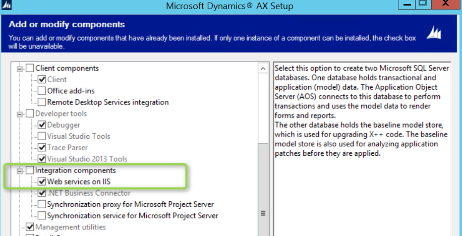
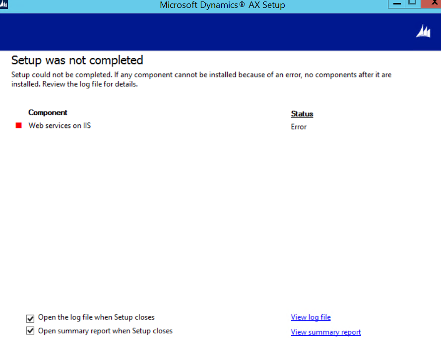
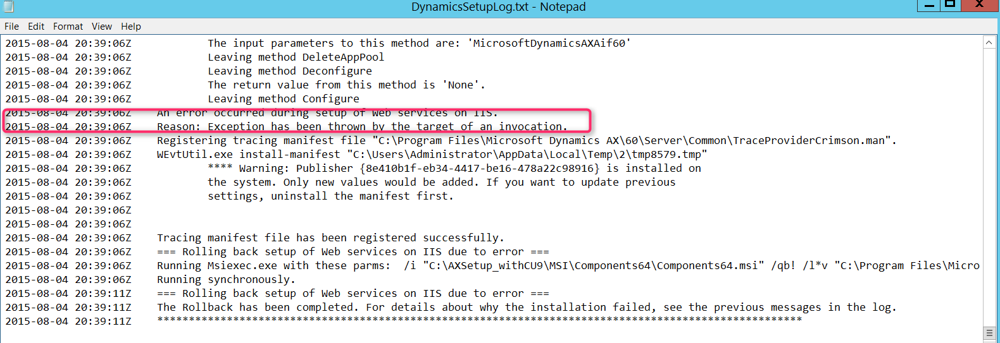
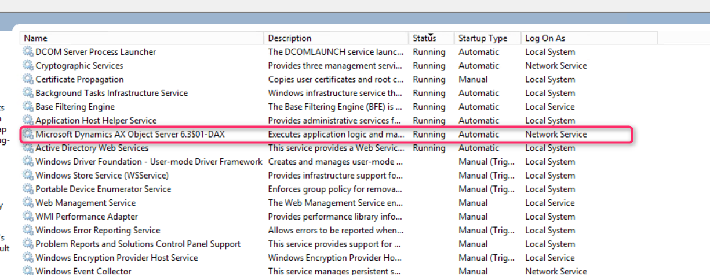

# Web Services on IIS - Exception has been thrown by the target of an invocation

When I try to install Web Services on IIS for Retails POS Component, and I got the problem.

This scenario shouldn't be common in a production environment, but, it is indeed quite common in a VM machine (I'm using virtual machine Hyper-V on Windows 8.1)

Error:

`Exception has been thrown by the target of an invocation`

So, the problem is relate to thee AOS Service account, which by default is usually `NT AUTHORITYNETWORK SERVICE` account.

but because of we are running on a Domain Controller Server, we should use any specific Domain account created just for running AOS services, then you’ll success installing Web Services on IIS.

Now please restart services and try again.

