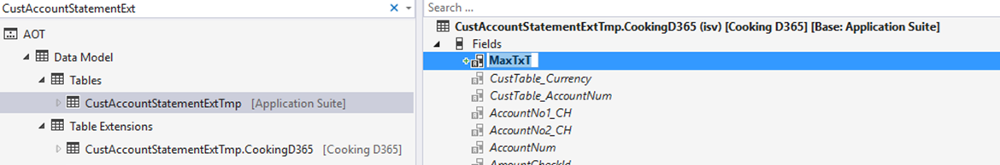
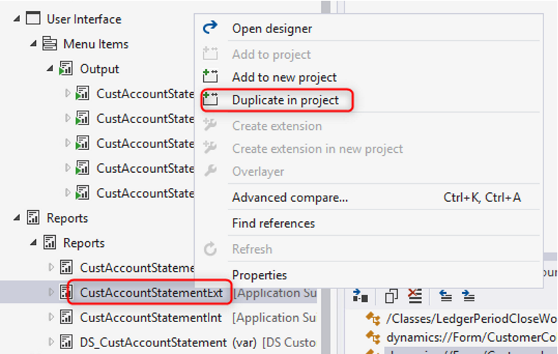
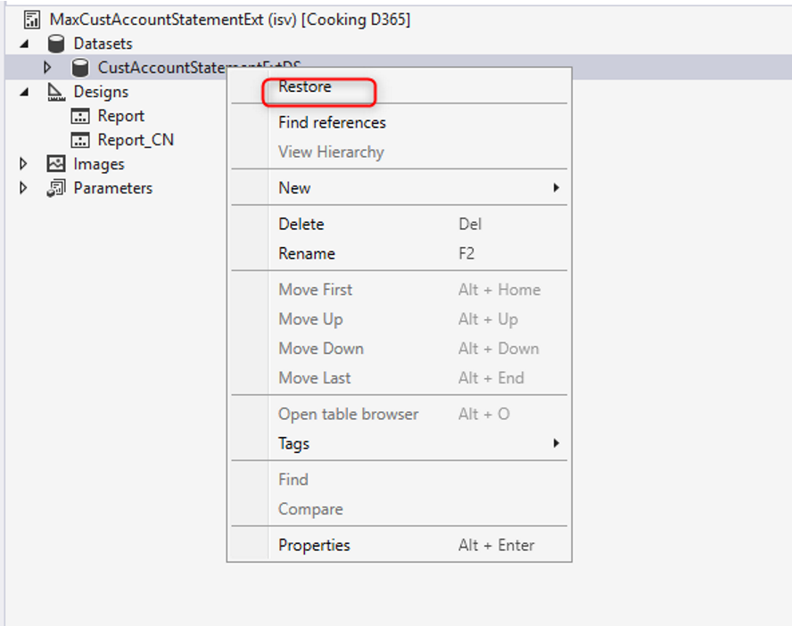
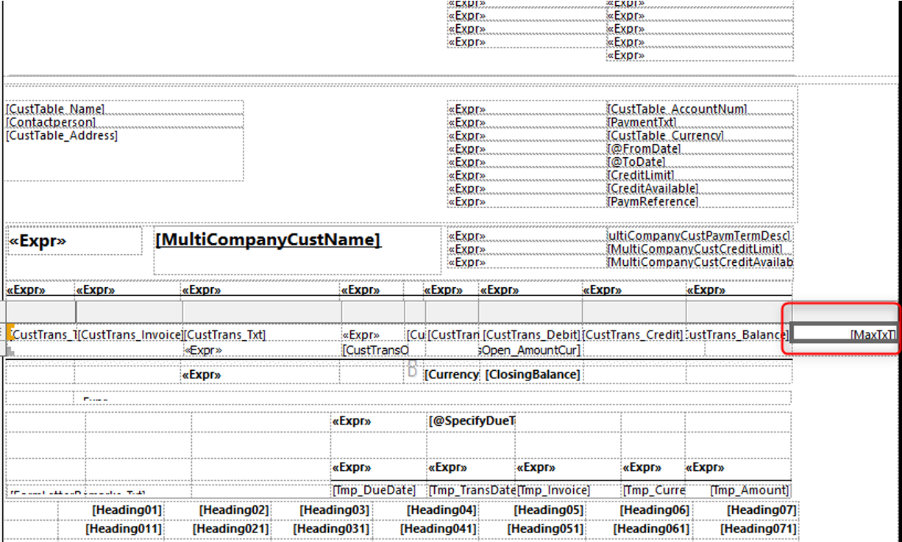
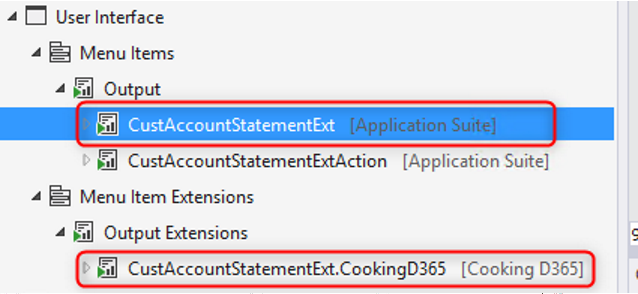
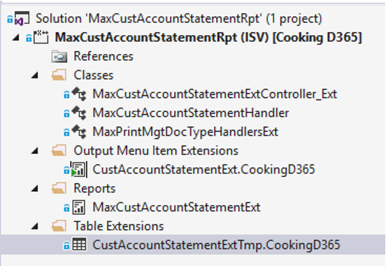
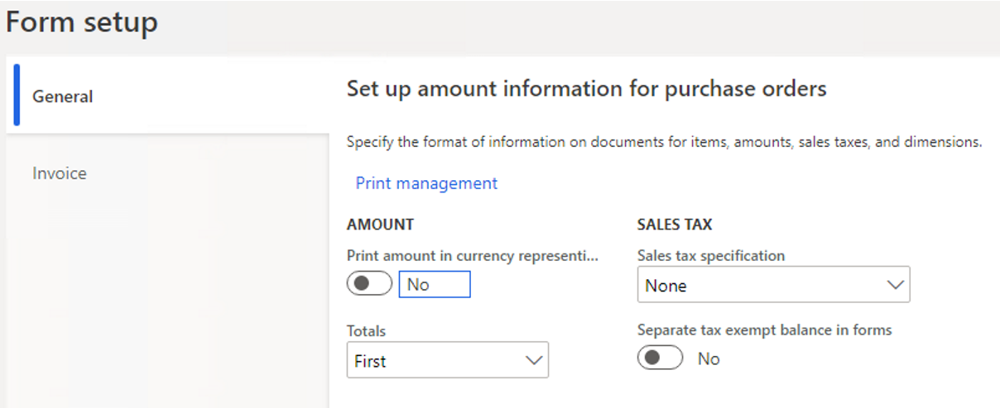
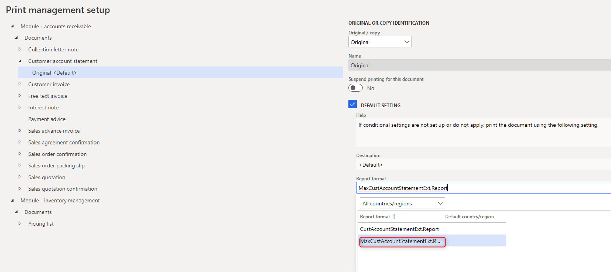
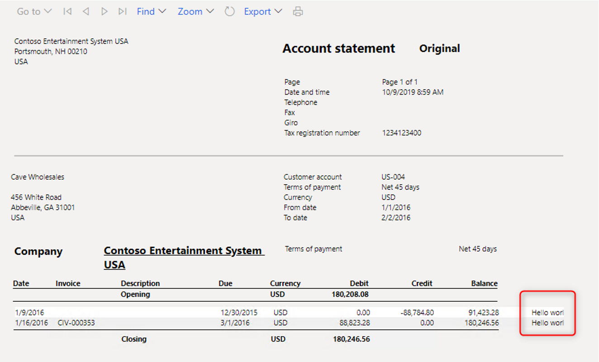

# Extend the standard reports in Dynamics 365 finance and operations (CustAccountStatementExt)


- [1. Adding a new field](#1-adding-a-new-field)
- [2. Duplicate the report](#2-duplicate-the-report)
- [3. Modify the report design, right click on report dataset and choose restore to refresh the new field](#3-modifythe-report-design-right-click-on-report-dataset-and-choose-restore-to-refresh-the-new-field)
- [4. Create a new Extension class that extends the standard report controller class.](#4-create-a-new-extension-classthat-extends-the-standard-report-controller-class)
- [5. Create new report handler class](#5-create-new-report-handler-class)
- [6. Add a delegate handler method to start to use your custom report.](#6-add-a-delegate-handler-method-to-start-to-use-your-custom-report)
- [7. Create extension for the existing menu items](#7-create-extension-for-the-existing-menu-items)
- [8. Update the Print management settings to use the custom business document](#8-update-the-print-management-settings-to-use-the-custom-business-document)
- [9. Run report and test the result](#9-run-report-and-test-the-result)

In this article, I will show the procedure for the SSRS Reports development and customization in Dynamics 365 finance and operations (Version 8.1 and above).

The scenario is you would like to extend **the customer account statement** report with 2 main tasks

* [Create custom design for the report](https://docs.microsoft.com/en-us/dynamics365/fin-ops-core/dev-itpro/analytics/custom-designs-business-docs?toc=/dynamics365/commerce/toc.json)
* [Expand the standard report data sets](https://docs.microsoft.com/en-us/dynamics365/fin-ops-core/dev-itpro/analytics/expand-app-suite-report-data-sets?toc=/dynamics365/commerce/toc.json)

Same with AX 2012 version, there is no change on how you developer a new SSRS report with query based and report data provider. But if you want to extend or modify the standard one you need to understand how to use extensions in general, Event handlers and Chain of Command.

The steps

### 1. Adding a new field

The main temp table is **CustAccountStatementExtTmp**, right click and create an extension; I'm going to add a new string field **MaxTxT**



### 2. Duplicate the report

Duplicate the **CustAccountStatementExt** report in *the Application explorer > AOT > Reports > CustAccountStatementExt* as shown in below screen shot:



Rename the report and provide any appropriate name: **MaxCustAccountStatementExt**

### 3. Modify the report design, right click on report dataset and choose restore to refresh the new field



Open report designer and add that field into a table



### 4. Create a new Extension class that extends the standard report controller class.

`class MaxCustAccountStatementExtController_Ext extends CustAccountStatementExtController{}`

```C#
//Add construct
public static MaxCustAccountStatementExtController_Ext construct()
{
    return new MaxCustAccountStatementExtController_Ext();
}
```

Copy the main method from the standard controller class and add references to the new Controller class

```C#
public static void main(Args _args)
{
    SrsPrintMgmtFormLetterController controller = new MaxCustAccountStatementExtController_Ext();
    controller.parmReportName(PrintMgmtDocType::construct(PrintMgmtDocumentType::CustAccountStatement).getDefaultReportFormat());
    controller.parmArgs(_args);
    MaxCustAccountStatementExtController_Ext::startControllerOperation(controller, _args);
}
 
protected static void startControllerOperation(SrsPrintMgmtFormLetterController _controller, Args _args)
{
    _controller.startOperation();
}
```

Optional method, determine which default design for report, some reports don't use `SrsPrintMgmtFormLetterController`, so you can implement this method by your own.

```C#
protected void outputReport()
{
    SRSCatalogItemName  reportDesign;
    reportDesign = ssrsReportStr(MaxCustAccountStatementExt,Report);
    this.parmReportName(reportDesign);
    this.parmReportContract().parmReportName(reportDesign);
    formletterReport.parmReportRun().settingDetail().parmReportFormatName(reportDesign);
    super();
}
```

### 5. Create new report handler class

`class MaxCustAccountStatementHandler{}`

We have two different ways to Populate the data in the Report handler class:

* Add a temp table Inserting event, row-by-row calculations. Go to `CustAccountStatementExtTmp` in AOT, expand Events node, and *Copy event handler method*.

```C#
class MaxCustAccountStatementExtHandler
{
    [DataEventHandlerAttribute(tableStr(CustAccountStatementExtTmp), DataEventType::Inserting)]
    public static void CustAccountStatementExtTmpInsertEvent(Common c, DataEventArgs e)
    {
        CustAccountStatementExtTmp  tempTable = c;
        CustGroup custGroup;
        select * from tempTable
            where tempTable.CustGroup == custGroup.CustGroup;

        tempTable.MaxTxT = custGroup.Description;
    }
}
```

* Add a data processing post-handler, inserting operations that use a single pass over the result set of the standard solution.

```C#
class MaxCustAccountStatementExtHandler
{
    [PostHandlerFor(classStr(CustAccountStatementExtDP), methodstr(CustAccountStatementExtDP, processReport))]
    public static void TmpTablePostHandler(XppPrePostArgs arguments)
    {
        CustAccountStatementExtDP dpInstance = arguments.getThis() as CustAccountStatementExtDP;
        CustAccountStatementExtTmp tmpTable = dpInstance.getCustAccountStatementExtTmp();
        CustGroup custGroup;
        ttsbegin;
        while select forUpdate tmpTable
        {
            select * from tempTable
                where tempTable.CustGroup == custGroup.CustGroup;
            tempTable.MaxTxT = custGroup.Description;
            tmpTable.update();
        }
        ttscommit;
    }
}
```

### 6. Add a delegate handler method to start to use your custom report.

In this example, extend the `getDefaultReportFormatDelegate` method in the `PrintMgtDocTypeHandlerExt` class by using the following code.

```C#
class MaxPrintMgtDocTypeHandlersExt
{
    [SubscribesTo(classstr(PrintMgmtDocType), delegatestr(PrintMgmtDocType, getDefaultReportFormatDelegate))]
    public static void getDefaultReportFormatDelegate(PrintMgmtDocumentType _docType, EventHandlerResult _result)
    {
        switch (_docType)
        {
            case PrintMgmtDocumentType::CustAccountStatement:
                _result.result(ssrsReportStr(MaxCustAccountStatementExt, Report));
                break;
        }
    }
}
```

### 7. Create extension for the existing menu items

Navigating to the `CustAccountStatementExt` output menu item and create extension.



Also make sure to set the value of the Object property `to MaxCustAccountStatementExtController_Ext` to redirect user navigation to the extended solution.

That's all, this is what you should have



### 8. Update the Print management settings to use the custom business document

Go to *Account payable > Inquiries and reports > Setup > Forms > Form setup*
Click **Print Management**, find the document configuration settings, and then select the custom design






### 9. Run report and test the result



