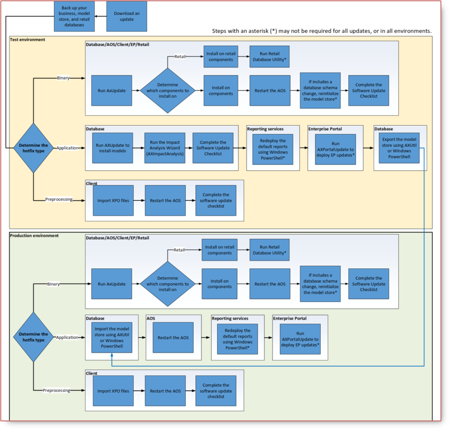

# Microsoft Dynamics AX 2012 Update Process

## What is an Update?

Updates include hotfixes, cumulative updates, and feature packs.

* **Hotfix**: A fix or set of fixes that address a specific issue, problem, or customer scenario.
* **Cumulative update**: An update that contains all previous hotfixes to date.
* **Feature pack**: A group of updates that relate to a feature area or group of functionality. Contains design changes.

### 1. Types of Hotfixes

To determine which type of update is in a package, download the package, and then extract contents and review
them to determine which type of update it is.

### 2. How can I tell if a binary update requires a schema update, and model store reinitialization?

The KB article will indicate  that a hotfix requires a schema update, and that you should reinitialize the model store.
You should assume that all cumulative updates require a schema update, and reinitialize the model store.

### 3. How can I tell if an application update contains a report or web part?

There is currently no simple way to tell if a hotfix contains a report or web part. We recommend that you assume that all cumulative updates, service packs, and feature packs contain reports and web parts, and re-deploy reports and Enterprise Portal.

If you encounter an error after installing a hotfix, try deploying reports and web parts.

## Installation Order

This diagram describes the order in which updates are applied in a test environment, and then applied in a production environment.

1. Apply updates to the database.
2. Apply updates to a single local AOS instance.
3. Apply updates to a single local client. (Compile, Synchronize, and get the environment running)
4. Deploy reports to the report server.
5. Deploy web parts to the Enterprise Portal server.
6. Deploy updates to any retail components.

The differences in a production environment are:

1. Import the model store from the test environment to apply updates to the database.
7. Mass deploy client updates (optional).

## Detailed Update Process

This diagram describes the update process in detail, in both the test and production environments.

## Update Tips and Tricks

* **Always update in a test environment first and run the Impact Wizard for application updates**
You can reduce the downtime of your production environment by fixing all code conflicts in a test environment, and identifying them early.

* **Make sure that you have the correct product version**
Most updates apply only to released versions of a product.
*Note: Many demonstration virtual machines run pre-release versions of Microsoft Dynamics AX, and cannot run updates.*

* **Install binary updates first, and if needed, reinitialize the model store before installing application updates**
If you do not reinitialize the model store, you will encounter many more errors in the Data Upgrade Cockpit.

* **Do not skip the Software Update Checklist**
After you install an update, on the Model store has been modified form, select Start the software update checklist.

* **If you must generate CIL, restart all AOS instances**

* **Install updates on all appropriate components (reports andweb parts)**
It is difficult to tell whether an update contains modified or new reports, or web parts—we recommend that redeploy reports and web parts with all CUs.

* **Check to see whether all of your current hotfixes are contained in the most recent cumulative update or feature pack—if not, reinstall it**
If you have a recent hotfix that is not included in the cumulative update or feature pack that you are installing, it will be removed. Reinstall the hotfix after you have applied update.

* **Consider slipstreaming updates if you are doing a fresh install**

* **If you are installing industry solutions, install them before installing updates**

* **To minimize downtime, consider importing the model store into a non-default schema in the production environment, and then switching it to be the default schema**
For information about using non-default schemas, read How to: Create, Drop, or Reinitialize a Model Store.

