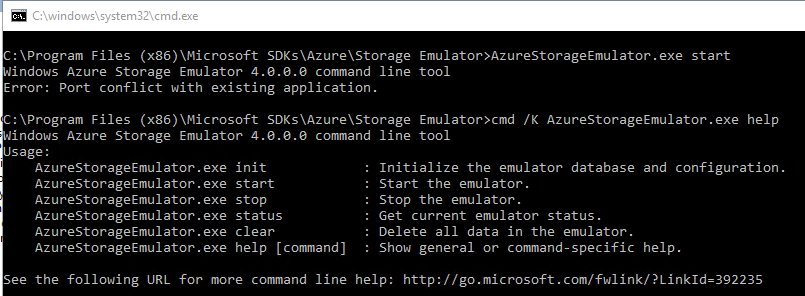
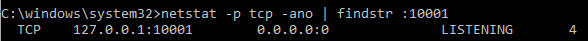
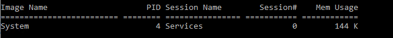
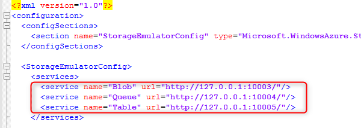
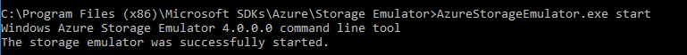

# Azure Storage Emulator 'Port conflict with existing application', Dynamics 365 finance and operations


- [1. Reason](#1-reason)
- [2. Resolution](#2-resolution)
  - [2.1. To determine the conflict program we can use this command in CMD](#21-to-determine-the-conflict-program-we-can-use-this-command-in-cmd)
  - [2.2. To change the default port for Azure storage Emulator](#22-to-change-the-default-port-for-azure-storage-emulator)

The Microsoft Azure storage emulator is a tool that emulates the Azure Blob, Queue, and Table services for local development purposes. You can test your application against the storage services locally without creating an Azure subscription or incurring any costs. When you're satisfied with how your application is working in the emulator, switch to using an Azure storage account in the cloud.

In Dynamics 365 finance and operations onebox environment, we also use Microsoft Azure Storage Emulator for same purposes. There is a common problem when you try to start its service or using Data entity Import/Export



`Port conflict with existing application`

## 1. Reason

By default, Azure storage emulator is using port number 10000, 10001, 10002 for Blob, Queue and Table services respectively. And there is a progress/system takes those ports already, so you are not able to start its service.
We can simply use this command in CMD to see which one has conflict

```netstat -p tcp -ano | findstr :10001```



The process ID 4 is currently taking port 10001.

## 2. Resolution

You can either terminate the conflict program or change the default port for Azure Storage Emulator.

### 2.1. To determine the conflict program we can use this command in CMD

Run following command to check which application/process has the same port, then simply go to task manager and terminate it.

```tasklist /fi "pid eq 4"```



### 2.2. To change the default port for Azure storage Emulator

Go to your storage emulator default installation folder, which is located at _**C:\Program Files (x86)\Microsoft SDKs\Azure\Storage Emulator**_, open the **AzureStorageEmulator.exe.config** by notepad and edit the port number to different number



When done, try to start its service again using

```AzureStorageEmulator.exe start```



Thank you for reading.

