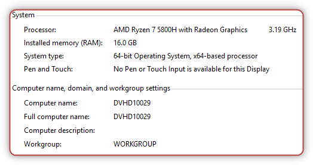

# Getting onebox VHD Dynamics 365 finance and operations virtual machine


- [1. Download Dynamics 365 finance and operations VHD files](#1-download-dynamics-365-finance-and-operations-vhd-files)
- [2. Extend the Evaluattion license](#2-extend-the-evaluattion-license)
- [3. Rename VM](#3-rename-vm)
  - [Update financial reporting](#update-financial-reporting)
  - [Update the Azure Storage Emulator](#update-the-azure-storage-emulator)
- [4. Location of packages, source code, and other AOS configurations](#4-location-of-packages-source-code-and-other-aos-configurations)
- [5. Redeploying or restarting the runtime on the VM](#5-redeploying-or-restarting-the-runtime-on-the-vm)
- [6. Update to the latest version](#6-update-to-the-latest-version)
- [7. For (VHD) that was released for versions 10.0.24 and later](#7-for-vhd-that-was-released-for-versions-10024-and-later)
  - [7.1 Register a new application in Azure Active Directory](#71-register-a-new-application-in-azure-active-directory)
  - [7.2 Run the setup script](#72-run-the-setup-script)

## 1. Download Dynamics 365 finance and operations VHD files

* Go to the LCS main page and select **Shared asset library** or go to Shared Asset Library.

* Select the asset type **Downloadable VHD**.

* Find the VHD you are looking for based on the desired Finance and Operation version. The VHD is divided into multiple file parts that you need to download. For example, the asset files that start with "VHD - 10.0.5" are the different files you need in order to install version 10.0.5.

* Download all files (parts) associated with the desired VHD to a local folder.

* After the download is complete, run the executable file that you downloaded, accept the software license agreement, and choose a file path to extract the VHD to.

* This creates a local VHD file that you can use to run a local virtual machine.

* Sign in to the VM by using the following credentials:

  * User name: **Administrator**
  * Password: **pass@word1**

* Provision the administrator user.


   For security reasons the reply URL setup for AAD was changed, The "Admin user provisioning" tool is deleted from 10.0.24 **cloud hosted** VM. More info here <https://learn.microsoft.com/en-us/dynamics365/fin-ops-core/dev-itpro/dev-tools/access-instances#frequently-asked-questions>.

   You still have it in the VHD machine.


## 2. Extend the Evaluattion license

* Run cmd with Admin right.
* Run `slmgr -dli` to check the current period status.

```cmd
Name: Windows(R), ServerDatacenterEval edition
Description: Windows(R) Operating System, TIMEBASED_EVAL channel
Partial Product Key: H6F8M
License Status: Licensed
Timebased activation expiration: 259199 minute(s) (180 day(s))
```

* Run `slmgr –rearm` to extend the evaluation period.
* Run `slmgr –dlv` to see how many extensions do you have left. You can only extend the license a limited number of times.

## 3. Rename VM


From the VHD 10.0.29 version, the VHD name named with the version of it own, before that the computer name always **MININT-F36S5EH**. So we don't have to remane the VM everytime we deploy a new VHD.



* Rename and restart the machine before you start development or connect to Azure DevOps.
* Update the server name in SQL Server

  * The default credential for SQL server is **axdbadmin** and password **AOSWebSite@12**
  
You can also see the password (`DataAccess.AxAdminSqlPwd`) in the `C:\AOSService\webroot\web.config`

To decrypt run this command:
`C:\AOSService\webroot\bin\Microsoft.Dynamics.AX.Framework.ConfigEncryptor.exe -decrypt C:\AOSService\webroot\web.config`

To encrypt run this command:
`C:\AOSService\webroot\bin\Microsoft.Dynamics.AX.Framework.ConfigEncryptor.exe -encrypt C:\AOSService\webroot\web.config`

If you see the error


   No certificate found for id '7366E25DC94FA8A400FA0037FFF3BB300D9482D4'

Please follow [this step](#7-for-vhd-that-was-released-for-versions-10024-and-later) first.

* Run following query

    ```sql
    --MININT-57EHFHJ
    sp_dropserver [old_name]
    sp_addserver [new_name], local
    ```


  In these commands, be sure to replace old_name with the old name of the server and new_name with the new name. By default, the old name is `MININT-F36S5EH`, but you can run select @@servername to get the old name. Additionally, be sure to restart the SQL Server service after the commands have finished running.


* Restart SQL service

* Open Reporting Services Configuration Manager for SQL Server 2016, then **Select Database**, select **Change Database**, and use the new server name.

### Update financial reporting

Go to LCS portal and download a one version package, we will need the scripts from it. Open a Microsoft Windows PowerShell command window as an admin, and run the following command. This command contains the default passwords that might have to be updated. Be sure to replace **new_name** with the new name.

```powershell
cd <update folder>\MROneBox\Scripts\Update
.\ConfigureMRDatabase.ps1 -NewAosDatabaseName AxDB -NewAosDatabaseServerName new_name -NewMRDatabaseName ManagementReporter -NewAxAdminUserPassword AOSWebSite@123 -NewMRAdminUserName MRUser -NewMRAdminUserPassword MRWebSite@123 -NewMRRuntimeUserName MRUSer -NewMRRuntimeUserPassword MRWebSite@123 -NewAxMRRuntimeUserName MRUser -NewAxMRRuntimeUserPassword MRWebSite@123
```

### Update the Azure Storage Emulator

* From the Start menu, open Microsoft Azure Storage Emulator - v4.0, and run the following commands.

    ```AzureStorageEmulator.exe start```

  > If you got an error **_Port conflict with existing application_**, please check this [post](/2020-04-05-azure-storage-emulator-port-conflict-with-existing-application/).

* This command verifies that the emulator is running.

    ```AzureStorageEmulator.exe status```

* Update the server name

    ```AzureStorageEmulator.exe init -server new_name```

    For more information about Azure storage emulator please follow <https://docs.microsoft.com/en-us/azure/storage/common/storage-use-emulator>

## 4. Location of packages, source code, and other AOS configurations

On a VM, you can find most of the application configuration by opening the web.config file of AOSWebApplication.

1. Start IIS.

2. Go to _Sites > AOSWebApplication_.

3. Right-click, and then click **Explore** to open File Explorer.

4. Open the **web.config** file in Notepad or another text editor. The following keys are of interest to many developers and administrators:

    * **Aos.MetadataDirectory** – This key points to the location of the packages folder that contains platform and application binaries, and also source code. (Source code is available only in development environments.) Typical values are: `c:\packages`, `c:\AosServicePackagesLocalDirectory`, and `J:AosServicePackagesLocalDirectory`.

    * **DataAccess.Database** – This key holds the name of the database.

    * **Aos.AppRoot** – This key points to the root folder of the Application Object Server (AOS) web application.

## 5. Redeploying or restarting the runtime on the VM

To restart the local runtime and redeploy all the packages, follow these steps.

1. Open File Explorer, and go to `C:\CustomerServiceUnit`.

2. Right-click **AOSDeploy.cmd**, and then click **Run as administrator**.

This process might take a while. The process is completed when the cmd.exe window closes. If you just want to restart AOS (without redeploying the runtime), run iisreset from an administrator Command Prompt window, or restart AOSWebApplication from IIS.

## 6. Update to the latest version

Please check this [document](https://docs.microsoft.com/en-us/dynamics365/fin-ops-core/dev-itpro/deployment/install-deployable-package) for versions 10.0.24

## 7. For (VHD) that was released for versions 10.0.24 and later

### 7.1 Register a new application in Azure Active Directory

To register a new application in Microsoft Azure Active Directory (Azure AD), follow the steps outlined in [Register app or web API](https://docs.microsoft.com/en-us/azure/active-directory/develop/quickstart-register-app). The new app registration should be for a web application, and the following redirect URIs should be added:

* `https://usnconeboxax1aos.cloud.onebox.dynamics.com/`
* `https://usnconeboxax1aos.cloud.onebox.dynamics.com/oauth/`

Once created, make note of the **Application (client) ID**.

### 7.2 Run the setup script

After you sign in with the **Administrator** account, right-click the desktop shortcut **Generate Self-Signed Certificates**, and select **Run as administrator**. When the script prompts for the application ID, provide the **Application (client) ID** created in Azure Active Directory.

When the script finishes, the environment is ready for use. At this time, you can run the Admin Provisioning tool to set the administrator account, permissions, and tenant. Make sure that the email provided is for the Azure Active Directory tenant in which the application registration was created.


https://learn.microsoft.com/en-us/dynamics365/fin-ops-core/dev-itpro/migration-upgrade/vso-machine-renaming


