# A good example of Trace Parser, Visual Studio and Excel

## **Prerequisite**

Before analysing a trace file, you might need to create a database for trace data. When you do troubleshooting actions on any VMs lower than D365FO 10.X.X (i.e. AX2012, D365FO 7.X, D365FO 8.X), no database was pre-created for trace's data. You will need to register a new one. Please [check here](/2020-06-30-create-a-new-database-for-trace-parser/).

A good tip of using Excel to analyse INSERT INTO statement captured in a Trace file: [Check here](/2020-06-30-a-good-tip-of-using-excel-to-analyse-insert-into-statement-captured-in-a-trace-file/).

Now we are good to get ourselves into this beautiful example.

## **The beautiful example**

### **The given case**

I had a case which was solved by analysing a trace file. That case gave me a huge happiness so I would like to share with you all. This case required some skills of analysing the trace file, understanding the logic of D365 indexes, navigating through Visual Studio, using SSMS queries to find the things we need. So, I believe this is a very nice example yet simple enough for everyone to start learning how to use such tools, especially Trace Parser.

#### *Issue description*

When I tried to authorise some Adjusted **Demand Forecast** records, I failed. System threw one error saying `The record already exists`.

<!--  -->

#### *Self issue-scoping*

The error message was pretty straightforward. It can be understood as: Cannot create a record in table **Demand Forecast** (with its name in `[AxDB].[ForecastSales]`) because the record already exists in such table.

> ***Note***
>
> In fact, different records in D365FO can be distinguished by some different key values of them. Such key values are unique for each record. So, for example, 2 records might have exactly similar details of `Sales Order` or `Sales Quantity` but they can be deemed different if they have different `RecID` values.

In this case, due to some reasons, the system was trying to insert a new record into ForecastSales table with some values which are already existing in such table. And, thus, failed.

We need to find what is/are that duplicated value(s) and try to fix it (them).

### **Troubleshooting**

#### *Visual Studio: Checking indexes*

First and foremost, for any ***"Record has been existed"*** issues, the very first thing that we would need to check is the indices of the tables because the indices are the ones which decide the duplication rule (Allowed or Not allowed). 

I would need to find which values in `ForecastSales` table do not allow duplicated values. This can be done by check `ForecastSales.Indexes` using `Visual Studio`.

Open `Visual Studio` and look for `forecastsales` table in the AOT.

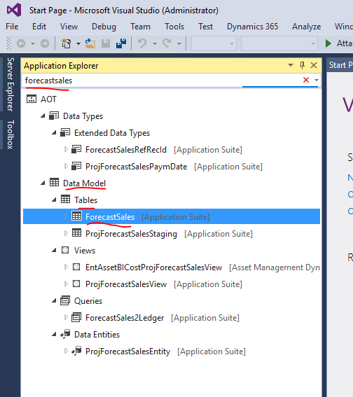

Right-click on it > `Open Designer` to open Table designer. Expand `Indexes` (this is somewhat bugging me for a long time because the plural form of *Index* should be *Indices* rather than *Indexes*, yet never mind).

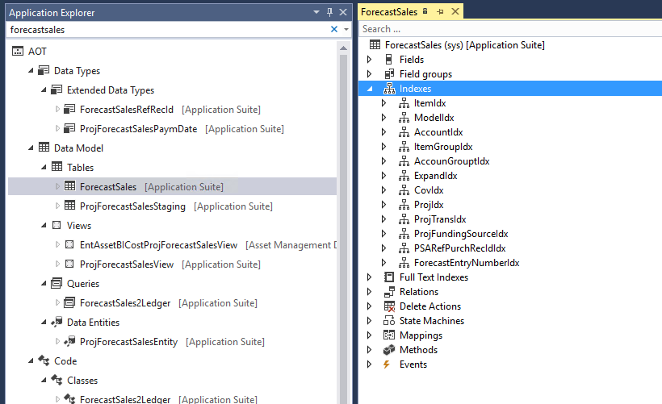

Choose `View` (on Menu bar) > `Properties Window` to open Properties window. Or, we can simply press `F4`.

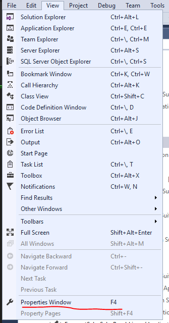

Check all indexes to see if any indexes ***DO NOT*** allow duplicate. Those should be the indexes that we should tackle.

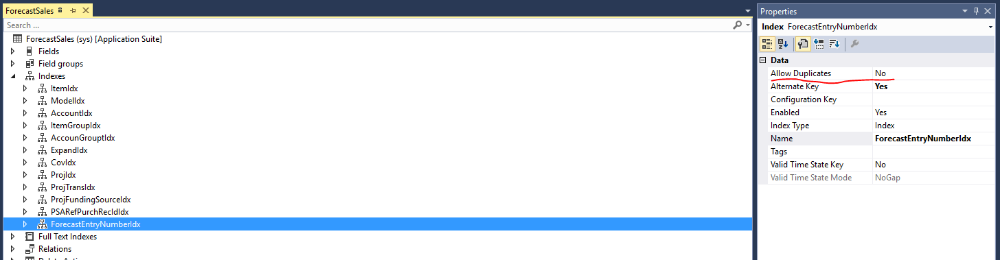

After analysing, I found that two indexes which do not allow duplicate. They were `ExpandIdx` and `ForecastEntryNumberIdx`. Expand those indexes to find which fields are included. They were (1) the combination of `ExpandID` and `RecID` and (2) `ForecastEntryNumber`.

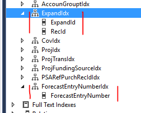

We would need to take note these fields.

#### *Trace parser: Analysing the trace file*

Before analysing any trace files, we would need to have the ID of the session in which we captured the file.

Go to `Question mark` on the upper-right corner of your browser > `Feedback` > Find the session ID.

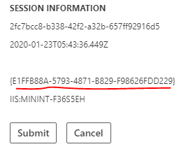

Open `Trace Parser` from Start menu and `Import` the trace file that we captured.

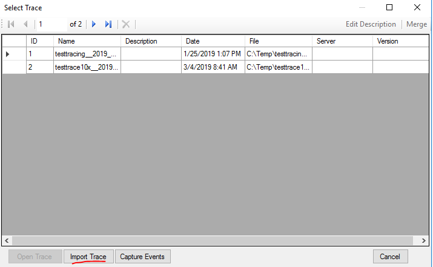

Select grouping with same `Session` that we just took note.

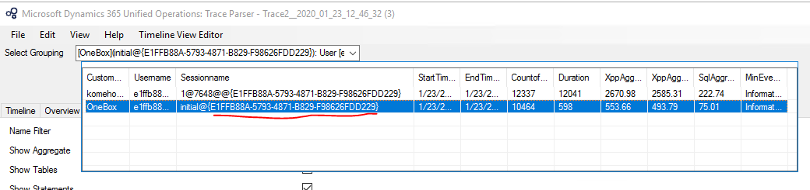

Usually, we will need to analyse Call Tree, X++ and SQL included in the trace file to understand the issue's cause. The approach much depends on the issue. In my case, I would look into SQL queries because I assumed that an `INSERT INTO` statement was made to the table `ForecastSales`.

Switch to SQL tab and search for *"forecastsales"* (pay attention to the asterisks). This means we want to search for any queries containing `"forecastsales"` no matter where the keyword is in the queries.

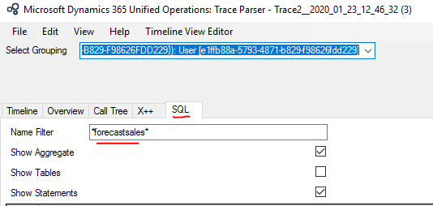

Luckily, I found one.

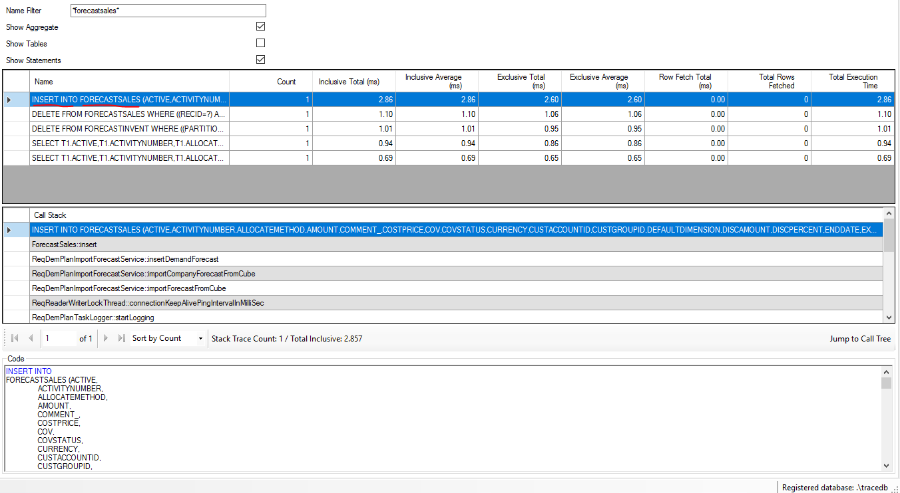

By analysing the INSERT INTO statement using Excel, I found the values that system tried inserting into `ForecastSales` table:
- `ExpandID` = '0'
- `RecID` = '5637233827'
- `ForecastEntryNumber` = 'PAU-000063760'

We would need to memorise these values or write them down somewhere.

#### *SSMS: Finding the duplicated values*

Open `Microsoft SQL Server Management Studio` from Start menu and log in with default Windows Authentication.

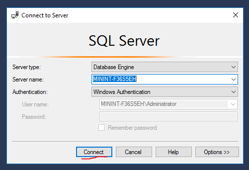

Open a `New Query` window by choosing `Databases` > `AxDB` > `New Query`.

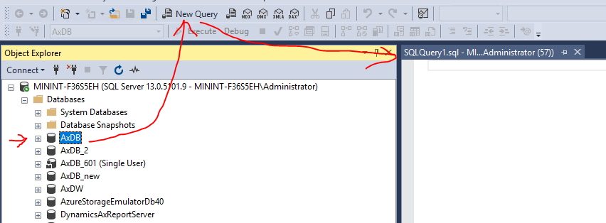

I would execute 3 different queries because I wanted to look for duplicated values in 3 fields:
- ExpandID = '0'
- RecID = '5637233827'
- ForecastEntryNumber = 'PAU-000063760'

Type queries in the window > Press `F5` or `Alt+X` or `Execute` button to execute the queries.

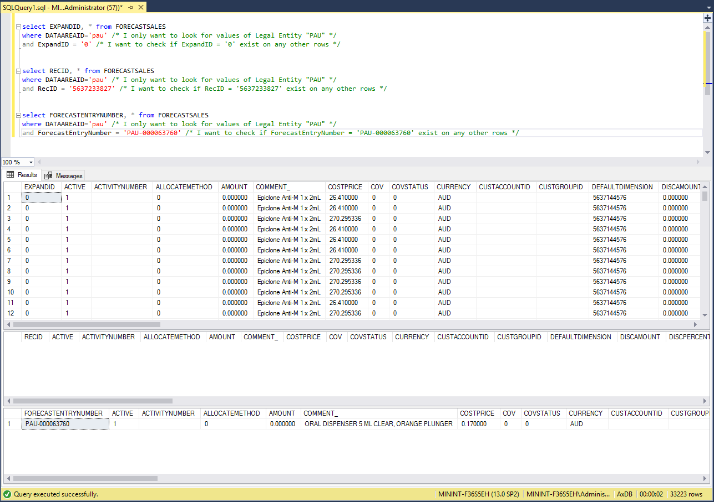

Examination:
- `ExpandID`: Hmm, quite a lot of records having a same value of '0', but when involving all these '0' with the unique `RecID`, the combination should be different (we can actually double check this one using the query `select RECID, count(RECID) as Number from FORECASTSALES group by RECID order by Number desc`, any Number >= 2 are the duplicated ones)
- `RecID`: No records were found --> This means there should be no problem when inserting a new record with RecID = '5637233827' into this table.
- `ForecastEntryNumber`: One record was found --> This means the system will throw such error "A record is existing in the table" when it tries inserting a new record because this field does not allow duplicate.

We found it.

#### *D360FO client > Number Sequence*

The solution for this particular issue should be simple: Find our way to the Number Sequence that is for ForecastEntryNumber and increase the `Next` value by 1.

I showed no solution here because the main purpose of this post is to demonstrate the way that we can co-use such available tools to approach an issue. Yet, each issue requires more or less different approaches. I hope that some quick look into these might plant some hints and you all can develop your own way of using them.

Happy Troubleshooting!
