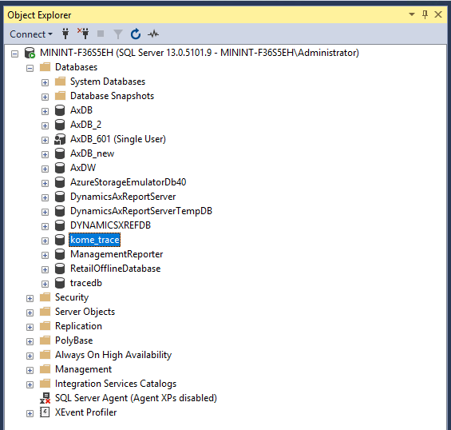

# Create a new database for Trace parser

When you do troubleshooting actions on any VM lower than D365FO 10.X.X (i.e. AX2012, D365FO 7.X, D365FO 8.X), chance is that no database was pre-created for trace's data. You will need to register a new one.

Open `Trace Parser` from Start meu. Choose `File` > `Register`.

Register a new database. **DO NOT** choose any existing database.

A new box will appear asking if you want to create it. Choose `Yes`.

A new database will be created for you in `SSMS`.

Now, you can start analysing trace files using `Trace Parser`.
