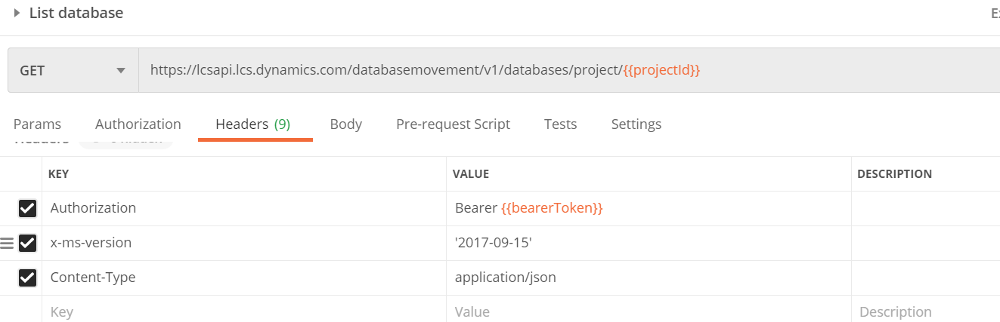

# Testing Dynamics 365 Finance Database Movement API with Postman


Microsoft provides a versioned set of capabilities that you can currently use to copy databases between environments, and to list and download database backups.

what you can do with Database movement API so far:

- List database backups
- Create database refresh
- Create a database export
- Get operation activity status

More supported actions will be added in later releases.

The endpoint uses **impersonation authentication** base, please follow to [register a new application by using the Azure portal](https://docs.microsoft.com/en-us/dynamics365/fin-ops-core/dev-itpro/database/api/dbmovement-api-authentication##register-a-new-application-by-using-the-azure-portal)

## 1. Postman environment setup

> Open Postman -> manage environments -> Add

```text
tenant_id: {tenant_id get from AAD}
client_id: {get from the application that you have created before}
client_secret: {get from the application that you have created before}
username: {LCS user name with owner permission}
password: {LCS user password}
grant_type: password
resource: https://lcsapi.lcs.dynamics.com
projectId: {Your LCS Project ID}
bearerToken: {this will be populated when authentication}
```


## 2. Authentication with Postman

You get the authentication bearer with **POST** method and https://login.microsoftonline.com/{{tenant_id}}/oauth2/token endpoint.

In the request Body, please do following:


Click **Send**, and you will have access token to start using the API.


## 3. Cosnume the APIs with Postman

To call the Database Movement API, you attach the access token as a bearer token to the authorization header in your HTTP request. So in Postman, modify the headers tab like bellow

```api
Authorization:Bearer {{bearerToken}}
x-ms-version:'2017-09-15'
Content-Type:application/json
```



### 3.1. List database backups

`
GET https://lcsapi.lcs.dynamics.com/databasemovement/v1/databases/project/{{projectId}}
`

And we’ll get a JSON with a list of the DB backups on our LCS Asset Library:

```json
{
    "DatabaseAssets": [
        {
            "Id": "12314234-862e-4a6a-800d-0c64e982284a",
            "ProjectId": 123123,
            "OrganizationId": 123124,
            "Name": "backup",
            "FileName": "ATbackup.bacpac",
            "FileDescription": "",
            "FileLocation": "https://uswedpl1catalog.blob.core.windows.net/product-ax7productname/******",
            "ModifiedDateTime": "2020-08-17T09:52:50.077",
            "CreatedDateTime": "2020-08-17T09:52:45.297",
            "CreatedByName": null,
            "ModifiedByName": null
        }
    ],
    "IsSuccess": true,
    "OperationActivityId": "5053e0dd-66e3-4832-a9f8-1e2d621562e1",
    "ErrorMessage": null,
    "VersionEOL": "9999-12-31T23:59:59.9999999"
}
```

### 3.2. Create database refresh

`
POST https://lcsapi.lcs.dynamics.com/databasemovement/v1/refresh/project/{projectId}/source/{sourceEnvironmentId}/target/{targetEnvironmentId}
`

```json
{
    "IsSuccess": true,
    "OperationActivityId": "55eb4327-9346-4c7b-82bd-fe8ef15112c6",
    "ErrorMessage": null,
    "VersionEOL": "9999-12-31T23:59:59.9999999"
}
```

### 3.3. Create a database export

`
POST https://lcsapi.lcs.dynamics.com/databasemovement/v1/export/project/{projectId}/environment/{environmentId}/backupName/{backupName}
`

```json
{
    "IsSuccess": true,
    "OperationActivityId": "55eb4327-9346-4c7b-82bd-fe8ef15112c6",
    "ErrorMessage": null,
    "VersionEOL": "9999-12-31T23:59:59.9999999"
}
```

### 3.4. Get operation activity status

`
GET https://lcsapi.lcs.dynamics.com/databasemovement/v1/fetchstatus/project/{projectId}/environment/{environmentId}/operationactivity/{operationactivityId}
`

```json
{
    "IsSuccess": true,
    "OperationActivityId": "6a90b45f-1764-4077-b924-3f4671540237",
    "ErrorMessage": null,
    "VersionEOL": "9999-12-31T23:59:59.9999999",
    "ProjectId": "12345",
    "EnvironmentId": "5362377c-bc37-4f92-b30e-fe0c1e664cc0",
    "ActivityId": "55eb4327-9346-4c7b-82bd-fe8ef15112c6",
    "CompletionDate": null,
    "OperationStatus": "InProgress"
}
```
