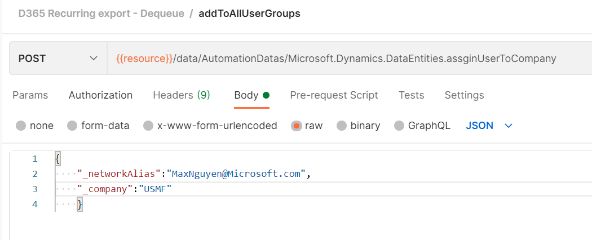
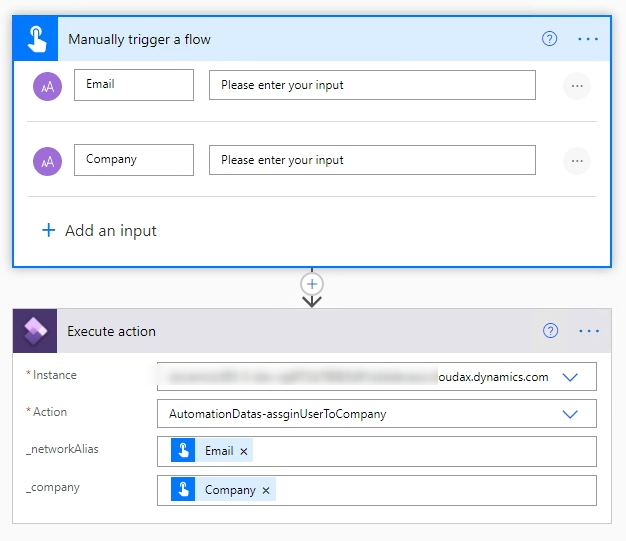
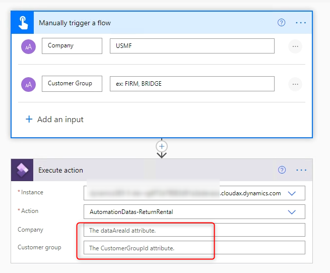

# All about Odata actions in Dynamics 365 Finance And Operations


ODATA actions in Data Entities provide a way to inject behaviors into the data model, or expose custom business logic from Dynamics 365 Finance & Operations.
You can add actions by adding a method to the data entity and then decorating the method with specific attributes *[SysODataActionAttribute]*

I use this Odata actions mostly in automation job like after refreshing data from PROD to UAT, we need to enable users, assign company to users, enable batches ...
Or simply consume it in Power Automate.

<!--more-->

# 1. Create an action to OData entity

You can create a new entity following [this standard docs](https://docs.microsoft.com/en-us/dynamics365/fin-ops-core/dev-itpro/data-entities/build-consuming-data-entities#add-a-new-data-entity-to-your-project) 
or you can duplicate any standard entity. I created **AutomationDataEntity**. Right-click the enitity, select View code and add the code

```cs
public class AutomationDataEntity extends common
{
    //1st example
    [SysODataActionAttribute("assignUserToCompany", false)]
    public static void assignUserToCompany(NetworkAlias _networkAlias, DataAreaName _company)
    {
        UserInfo userInfo;
        ttsbegin;
        select firstonly forupdate userInfo
            where userInfo.networkAlias == _networkAlias;
        userInfo.company = _company;
        userInfo.update();
        ttscommit;
    }

    //2nd example
    [SysODataActionAttribute("ReturnRental", true)]
    public str ReturnRental()
    {
        return "Rental was successfully returned. Thanks for your business";
    }

    //following 3rd example of an OData action takes in a parameter and returns a list
    [SysODataActionAttribute("GetColors", true),
    SysODataCollectionAttribute("return", Types::Record, "CarColor")]
    public List GetColorsByAvailability(boolean onlyAvailableVehicles)
    {
        List returnList = new List(Types::Record);
        // do something
        return returnList;
    }

    
}
```

In this example, the ```SysODataActionAttribute``` class decorates the ```assginUserToCompany``` method that is exposed as an action. The first argument of the attribute is the publicly exposed name of the action, and the second argument indicates whether this action need an entity instance or not. If you set the second argument to *false*, the method has to be `static`.

> You might need reset IIS service to update Odata endpoint.

# 2. Test Entity Odata actions with Postman and Power Automate

## 2.1. With Postman

Please follow [this document](https://docs.microsoft.com/en-us/dynamics365/fin-ops-core/dev-itpro/data-entities/third-party-service-test) for basic configurations in Dynamics 365 Finance & Operation, Azure to work with Postman.

### 2.1.1. Let's use the first example. 
Specify Odata endpoint request with POST method into Postman application

```markdown
[finopsURL]/data/AutomationDatas/Microsoft.Dynamics.DataEntities.assignUserToCompany
```

[finopsURL] = https://[yourenvironment].cloudax.dynamics.com

Here is the Json file contains the parameters for ```assignUserToCompany``` method

```json
{
    "_networkAlias":"Max.Nguyen@Microsoft.com",
    "_company":"USMF"
}
```

Click **Send** and you will get your logic executed.



### 2.1.2. Let's try with the second example

Everything should be remain the same, you just need to change the method to `ReturnRental`

```markdown
[finopsURL]/data/AutomationDatas/Microsoft.Dynamics.DataEntities.ReturnRental
```

Click **Send** and you will get an error

```json
{
    "Message": "No HTTP resource was found that matches the request URI 'https://[devaos].cloudax.dynamics.com/data/AutomationDatas/Microsoft.Dynamics.DataEntities.ReturnRental'. No route data was found for this request."
}
```

The reason is that you set the second argument to `true`, that means you need an instance for `AutomationDatas` entity before you can use `ReturnRental` method.
My entity created based on `CustGroup` table, so to get an instance I need `DataAreaId` and `CustGroupID`. The correct endpoint should be

```markdown
[finopsURL]/data/AutomationDatas(dataAreaId='USMF',CustomerGroupId='BRIDGE')/Microsoft.Dynamics.DataEntities.ReturnRental
```

The result

```json
{
    "@odata.context": "https://[devaos].cloudax.dynamics.com/data/$metadata#Edm.String",
    "value": "Rental was successfully returned. Thanks for your business"
}
```

## 2.2. With Power Automate

### 2.2.1. With the first example

Create a simple Power Automate with Dynamics 365 Finance & Operations connector, to consume Odata actions we use "Execute action" action following



### 2.2.2. With the second example

when specify `action` in `Execute action`, Dynamics 365 Finance & Operations connector understand that this needs an instance



# 3. More

In Odata actions, you can return a list

```cs
[SysODataActionAttribute("GetColors", true),
SysODataCollectionAttribute("return", Types::Record, "CarColor")]
public List GetColorsByAvailability(boolean onlyAvailableVehicles)
{
    List returnList = new List(Types::Record);
    // do something
    return returnList;
}
```

The following example of an OData action takes in list a parameter.

```cs
[SysODataActionAttribute("GetColorsByAvailability", false),
SysODataCollectionAttribute("InventSiteIdList", Types::String),
SysODataCollectionAttribute("return", Types::String)]
public static str GetColorsByAvailability(List InventSiteIdList)
{
    str strCommaSeperated;
    List list = new List(Types::String);
    ListEnumerator  ListEnumerator;
    ListEnumerator = InventSiteIdList.getEnumerator();
    while (ListEnumerator.moveNext())
    {
        strCommaSeperated += strFmt('%1, ', ListEnumerator.current()) ;
    }
    return strCommaSeperated;
}
```

In those examples,the `SysODataCollectionAttribute` class enables OData to expose strongly typed collections from X++. This class takes in three parameters:

* The name of the parameter that is a list (Use return for the return value of the method.).
* The X++ type of the members of this list.
* The public name of the OData resource that is contained in the collection.

You can find actions that are defined on data entities by searching for the `SysODataActionAttribute` attribute in `metadatasearch`.

If you want to check how many Odata actions available for an entity, you can go here and search for an entity.

```markdown
https://[devaos].cloudax.dynamics.com/data/$metadata
```

```xml
<Action Name="removeDeleteCT" IsBound="true">
<Parameter Name="AutomationData" Type="Collection(Microsoft.Dynamics.DataEntities.AutomationData)"/>
<Parameter Name="_entityName" Type="Edm.String"/>
</Action>
<Action Name="assginUserToCompany" IsBound="true">
<Parameter Name="AutomationData" Type="Collection(Microsoft.Dynamics.DataEntities.AutomationData)"/>
<Parameter Name="_networkAlias" Type="Edm.String"/>
<Parameter Name="_company" Type="Edm.String"/>
</Action>
<Action Name="ReturnRental" IsBound="true">
<Parameter Name="AutomationData" Type="Microsoft.Dynamics.DataEntities.AutomationData"/>
<ReturnType Type="Edm.String"/>
</Action>
<Action Name="addToAllUserGroups" IsBound="true">
<Parameter Name="AutomationData" Type="Collection(Microsoft.Dynamics.DataEntities.AutomationData)"/>
<Parameter Name="_userId" Type="Edm.String"/>
</Action>
```

At the time I'm writing this post, Odata actions does not support COC extension (A 18, P 42). So if you write some thing like this, it won't work.

```cs
[ExtensionOf(dataentityviewstr(CustCustomerGroupEntity))]
final class CustCustomerGroupEntity_KA_Extension
{
    [SysODataActionAttribute("ReturnRental", false)]
    public static str ReturnRental()
    {
        return "Rental was successfully returned. Thanks for your business";
    }

}
```

Thank you for reading.

