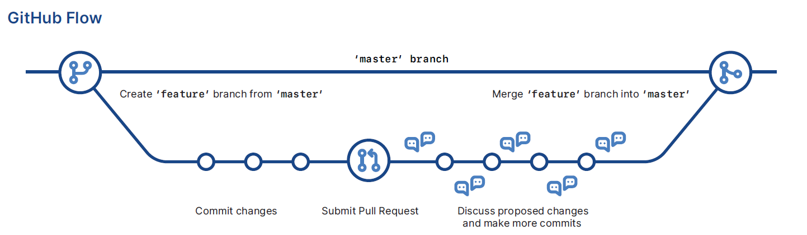
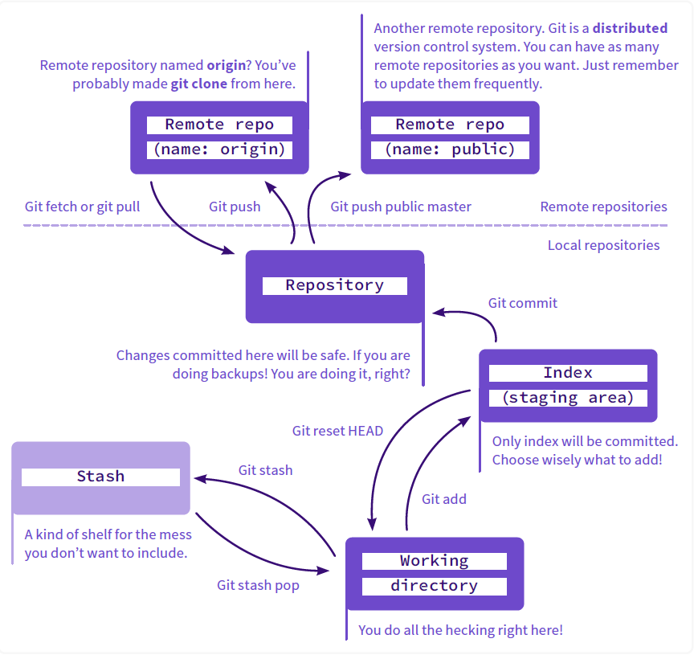

# Git & Github cheatsheet

## 1. Install

>Configure user information for all local repositories

`$ git config --global user.name "[name]"`

Sets the name you want attached to your commit transactions

`$ git config --global user.email "[email address]"`

Sets the email you want attached to your commit transactions

`$ git config --global color.ui auto`

Enables helpful colorization of command line output

## 2. Branches

>Branches are an important part of working with Git. Any commits you make will be made on the branch you’re currently “checked out” to. Use `git status` to see which branch that is.

`$ git branch [branch-name]`

Creates a new branch

`$ git switch -c [branch-name]`

Switches to the specified branch and updates the working directory

`$ git merge [branch]`

Combines the specified branch’s history into the current branch. This is usually done in pull requests, but is an important Git operation.

`$ git branch -d [branch-name]`

Deletes the specified branch

## 3. Create repositories

>A new repository can either be created locally, or an existing repository can be cloned. When a repository was initialized locally, you have to push it to GitHub afterwards.

`$ git init`

The git init command turns an existing directory into a new Git repository inside the folder you are running this command. After using the `git init` command, link the local repository to an empty GitHub repository using the following command:

`$ git remote add origin [url]`

Specifies the remote repository for your local repository. The url points to a repository on GitHub.

`$ git clone [url]`

Clone (download) a repository that already exists on GitHub, including all of the files, branches, and commits

## 4. The .gitignore file

Sometimes it may be a good idea to exclude files from being tracked with Git. This is typically done in a special file named `.gitignore`. You can find helpful templates for `.gitignore` files at [github.com/github/gitignore](https://github.com/github/gitignore).

`logs/
*.notes
pattern*/`

Save a file with desired patterns as .gitignore with either direct string
matches or wildcard globs.

`git config --global core.excludesfile [file]`

system wide ignore pattern for all local repositories

## 5. Synchronize changes

> Synchronize your local repository with the remote repository on GitHub.com

`$ git fetch`

Downloads all history from the remote tracking branches

`$ git merge`

Combines remote tracking branches into current local branch

`$ git push`

Uploads all local branch commits to GitHub

`$ git pull`

Updates your current local working branch with all new commits from the corresponding remote branch on GitHub. `git pull` is a combination of `git fetch` and `git merge`

## 6. Make changes

`git status`

Show modified files in working directory, staged for your next commit

`$ git log`

Browse and inspect the evolution of project files

`$ git log --follow [file]`

Lists version history for a file, beyond renames (works only for a single file)

`$ git diff [first-branch]...[second-branch]`

Shows content differences between two branches

`git diff --staged`

Diff of what is staged but not yet committed

`$ git show [commit]`

Outputs metadata and content changes of the specified commit

`$ git add [file]`

Snapshots the file in preparation for versioning

`$ git commit -m "[descriptive message]"`

Records file snapshots permanently in version history

`git commit -am "Your commit message"`

Combine `add` and `commit` for tracked files

`git config --global alias.ac '!git add -A && git commit -m'`

Create a new command, eg combine `add` and `commit` in to `ac` command

## 7. Temporary commits


Temporarily store modified, tracked files in order to change branches


`git stash`

Save modified and staged changes

`git stash list`

List stack-order of stashed file changes

`git stash pop`

Write working from top of stash stack

`git stash drop`

Discard the changes from top of stash stack

## 8. Redo commits

Erase mistakes and craft replacement history

`$ git reset [commit]`

Undoes all commits after `[commit]`, preserving changes locally

`$ git reset --hard [commit]`

Discards all history and changes back to the specified commit

> CAUTION! Changing history can have nasty side effects. If you need to change commits that exist on GitHub (the remote), proceed with caution. If you need help, reach out at [github.community](https://github.community/) or contact support.

## 9. Search

`$ git grep "hello"`

A text search on all files in the directory

`$ git grep "hello" v2.5`

In any version of a text search:

`$ git log -s 'keyword'`

Show commits that introduced a specific keyword

`$ git log -S 'keyword' --pickaxe-regex`

Show commits that introduced a specific keyword (using a regular expression)

## 9. Github flow

## 10. Glossary

- **git**: an open source, distributed version-control system
- **GitHub**: a platform for hosting and collaborating on Git repositories
- **commit**: a Git object, a snapshot of your entire repository compressed into a SHA
- **branch**: a lightweight movable pointer to a commit
- **clone**: a local version of a repository, including all commits and branches
- **remote**: a common repository on GitHub that all team members use to exchange their changes
- **fork**: a copy of a repository on GitHub owned by a different user
- **pull request**: a place to compare and discuss the differences introduced on a branch with reviews, comments, integrated tests, and more
- **HEAD**: representing your current working directory, the HEAD pointer can be moved to different branches, tags, or commits when using `git switch`

