# Auto posting journals Dynamics AX 2012

The previous post dealt primarily with the question how the selection and posting of journals can be restricted. Within this post I would like to change the perspective and take a look at a function that allows a periodic posting of a number of journals that have been created.

The “post journals” functionality I refer to here can be found in the General Ledger module in the journal entries section. (In prior Dynamics AX versions it can be found in the periodic General Ledger module section).

As the information that has been provided e.g. on [TechNet](https://technet.microsoft.com/en-us/library/aa583389.aspx) for the “post journals” functionality is a bit sparse and as several questions in regards to this function have been brought forward recently, I decided summarizing the different setup and processing options in this post.

_Note: Please note that the following illustrations and explanations will only refer to posting General Ledger journals. The post journals function is, however, not limited to those kind of journals but can be applied to other journals as well. Please see the following [summary](https://technet.microsoft.com/en-us/library/aa570269.aspx)._

In order to explain the different setup options of the post journals feature, I started setting up some daily General Ledger journals that included either no error (“OK”), some journal lines with errors (“Partly ok”) or only erroneous lines (“Error”). The next screenshot exemplifies the setup of some of those journals used.

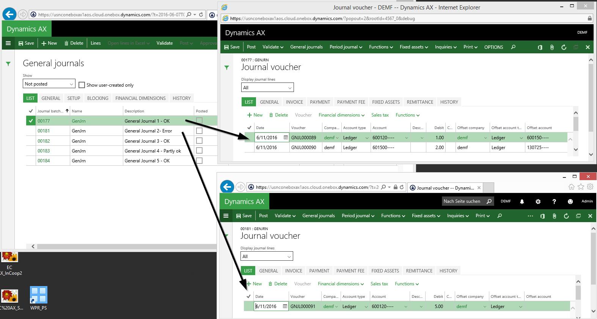

## Option 1: Select the journals, and post them  

Once all demo journals have been prepared, I opened the post journals window and selected them through the identic button.

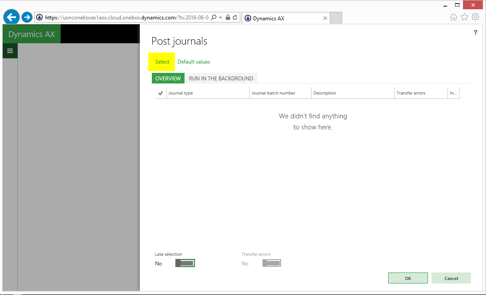

After all journals have been selected, the posting process was initiated by hitting OK button in the post journal form.

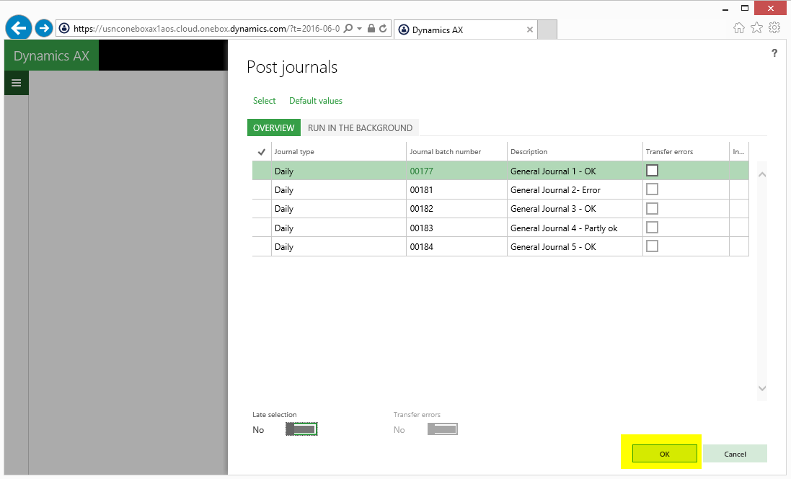  

Result:  
The result of this first posting test was that all journals except the ones that contained errors were posted.  
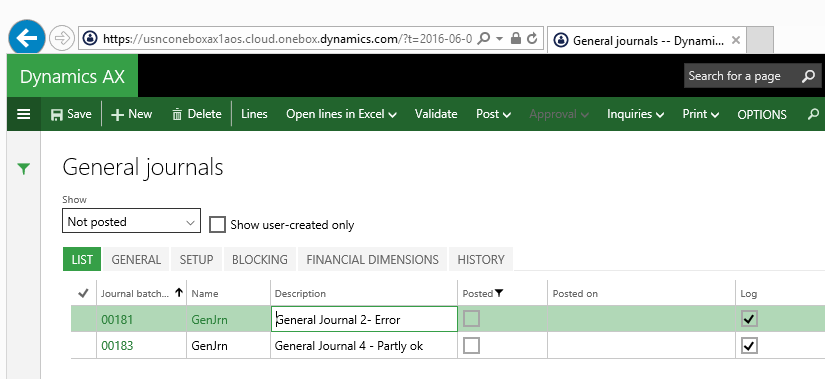  

Newly created journals that did not contain any error remained, however, unposted.

## Option 2: Select the journals and post them by using a batch job  

To get also those journals automatically posted that have been created later on, I deleted all unposted previously generated journals, setup some new ones and selected them as before in the post journals form.  
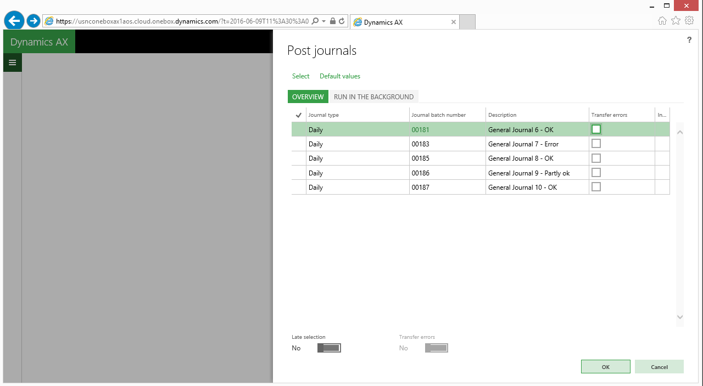

This time I changed the posting process by making use of a batch process that runs every some minutes and that does the posting for me.  
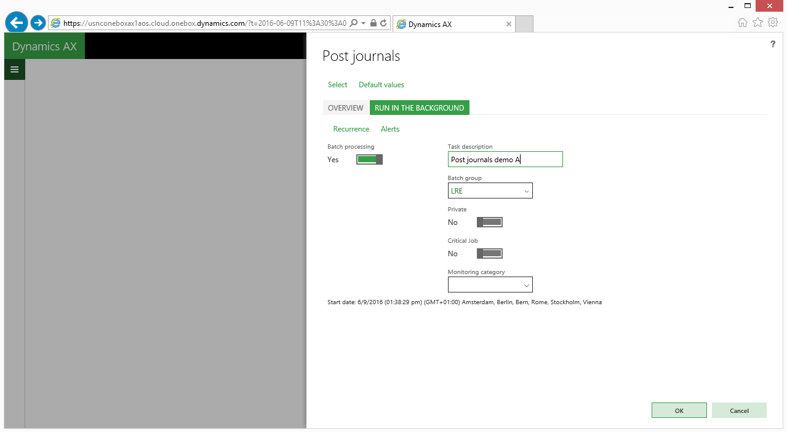  

Result:

As before, all journals have been posted except the ones that contained errors.  
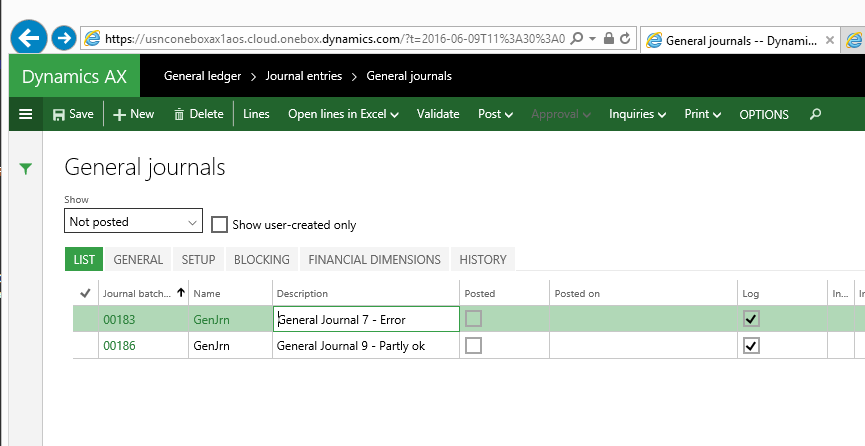

My next step was setting up a new journal (No. 188) that did not contain any error.  

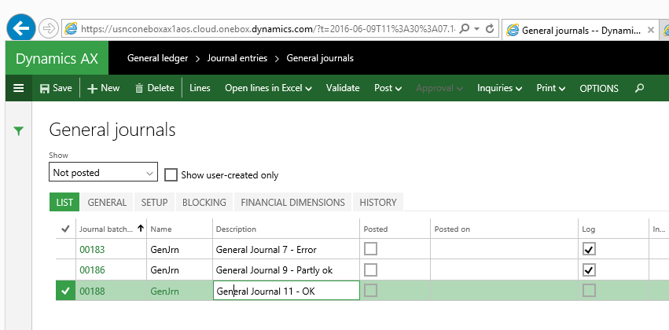

Because of my posting setup I expected that the batch process will pick up the newly generated journal and post it. Yet, as nothing happened, I finally checked the batch job history window and noticed that the batch job stopped because it could not process the first two journals that contained erroneous lines. Please see the next screen-print.

## Option 3: As option 2 & select the transfer errors checkbox  

As processing newly created journals did not work with the previous approach, I repeated the earlier setup steps and created a number of new journals. This time I tried processing them by selecting the ‘transfer errors’ checkboxes (please see below).

**Result**:  
As expected, all journals except the ones that contained errors were posted. After setting up a new journal that contained no error I expected that this time the newly created journal will be posted.

Yet, unfortunately nothing happened to the newly created journal as the batch job stopped as before after detecting errors.

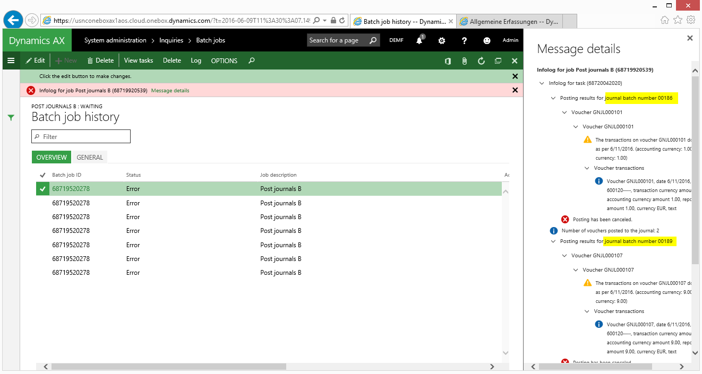

**Note**: The difference between the 2nd and 3rd setup option is related to the journal that was partly ok. That is, this time all journal lines that did not include an error in the original (partly correct) journal No. 189 were posted and the journal lines that contained errors were transferred to a new journal No. 191 that contains only the erroneous lines.

## Option 4: As option 3 but with the late selection and transfer errors checkbox activated  

Since none of the prior setup options successfully posted the journals that I created subsequently, I changed the setup in the post journals form once again. This time – after selecting the journals that I want to post – the “late selection” and “transfer error” parameters were activated as shown in the next screen-print.

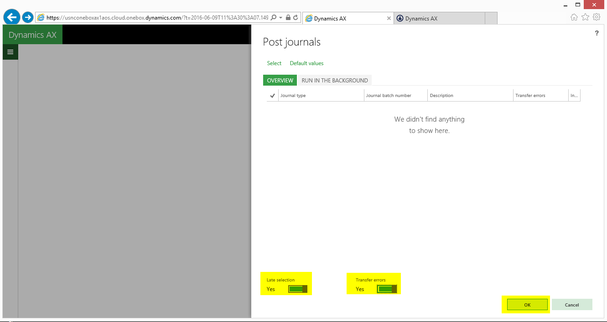  

**Result**:

This time all erroneous journals/journal lines remained unposted as before but the journal that I created later on – in my case journal No. 196 – was finally picked up by the batch process and posted automatically as the following screen-prints prove.

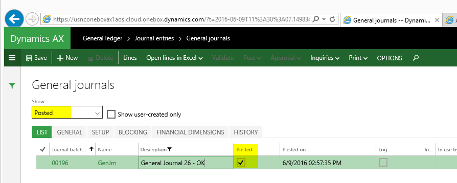

Note: Despite the fact that the newly generated journal was successfully posted, the batch job still continued running (and ending) with errors because of the two journals that contained lines with errors.

Even though this issue in not directly related to the journal posting process itself, it can become quite cumbersome, as it might flood your mailbox with error messages / Emails if alerts and/or Email notifications have been setup that control the processing of batch jobs.
