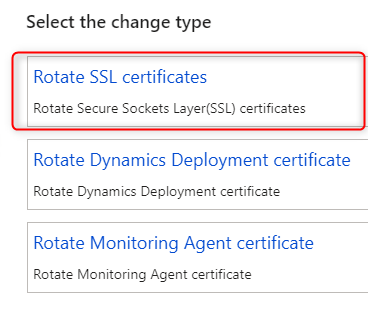

# Troubleshooting DVT script for service model - Dynamics 365 Finance & Operations Tier 1 Upgrade


While doing upgrade to the latest version Dynamics 365 Finance & Operations on tier 1 environment, you might got some errors related to DVT auto scripts.

<!--more-->

## 1. DVT script for service model: AOSService on machine

An error at step 72

```xml
<?xml version="1.0" encoding="UTF-8"?>
<Step>
   <ID>72</ID>
   <RunbookID>498de9aee46e403e9dcd97b40166775e</RunbookID>
   <PackageId>dd4119e4331248d5a6ba9b987eef440d</PackageId>
   <PackageType>PlatAppBinaryHotfixPackage</PackageType>
   <CompletedManually>false</CompletedManually>
   <Description>DVT script for service model: AOSService on machine: </Description>
   <MachineName></MachineName>
   <ServiceModelName>AOSService</ServiceModelName>
   <ScriptToExecute>
      <FileName>AutoRunDVT.ps1</FileName>
      <Automated>true</Automated>
      <Description>Run the AOS DVTs</Description>
      <RetryCount>1</RetryCount>
      <TimeoutValue>1</TimeoutValue>
      <InvokeWithPowershellProcess>false</InvokeWithPowershellProcess>
      <DoNotAutoResume>false</DoNotAutoResume>
      <DynamicStepDefinition />
   </ScriptToExecute>
   <StepType>DVT</StepType>
   <StepConcurrency>Multiple</StepConcurrency>
   <ScriptExecutionOutput />
</Step>
```

Event log error details


System.Net.WebException: The underlying connection was closed: Could not establish trust relationship for the SSL/TLS secure channel. ---> System.Security.Authentication.AuthenticationException: The remote certificate is invalid according to the validation procedure.


### Solution

You need to abort the current process in LCS because this option will only show for environments in the **Deployed** state, then do "Rotate the SSL certificates"

* On the Environment details page, click `Maintain > Rotate secrets`.
* Select Rotate the SSL certificates and confirm that you want to perform this action.



## 2. Step 73 - DVT script for service model: MROneBox on machine

### 2.1 The error from `runbook`

```xml
<?xml version="1.0" encoding="UTF-8"?>
<Step>
   <ID>73</ID>
   <RunbookID>498de9aee46e403e9dcd97b40166775e</RunbookID>
   <PackageId>dd4119e4331248d5a6ba9b987eef440d</PackageId>
   <PackageType>PlatAppBinaryHotfixPackage</PackageType>
   <CompletedManually>false</CompletedManually>
   <Description>DVT script for service model: MROneBox on machine: </Description>
   <MachineName></MachineName>
   <ServiceModelName>MROneBox</ServiceModelName>
   <ScriptToExecute>
      <FileName>AutoRunDVT.ps1</FileName>
      <Automated>true</Automated>
      <Description>Run the AOS DVTs</Description>
      <RetryCount>1</RetryCount>
      <TimeoutValue>1</TimeoutValue>
      <InvokeWithPowershellProcess>false</InvokeWithPowershellProcess>
      <DoNotAutoResume>false</DoNotAutoResume>
      <DynamicStepDefinition />
   </ScriptToExecute>
   <StepType>DVT</StepType>
   <StepConcurrency>Multiple</StepConcurrency>
   <ScriptExecutionOutput />
</Step>
```

### 2.2 Event log error details


Exception : System.Management.Automation.RemoteException: An error was encountered while updating the Financial Reporting components.
TargetObject : An error was encountered while updating the Financial Reporting components.


### 2.3 Solution

To resolve this, we will need to reset [financial reporting data mart](https://docs.microsoft.com/en-us/dynamics365/fin-ops-core/dev-itpro/analytics/reset-financial-reporting-datamart-after-restore#reset-the-financial-reporting-data-mart-through-windows-powershell)

* Open PowerShell and execute the following script, this will execute reset datamart

```ps
cd K:\MROneBox\MRInstallDirectory\Server\MRDeploy\
Import-Module .\MRDeploy.psd1
Reset-DatamartIntegration -Reason OTHER -ReasonDetail "<reason for resetting>" -SkipMRTableReset
```


You need to stop MR2012ProcessService service.

`NET STOP "MR2012ProcessService"`


* After reset datamart, we need to execute the step 73 again, find the latest deployable package applied to the environment. It will be under folder `<ServiceVolue>:\DeployablePackages\<PackageGUID>\MROneBox\Scripts\Update`

Execute `AutoRunDVT.ps1` in Powershell

```ps
.\AutoRunDVT.ps1
```

If it can be executed without error, you can go ahead and resume the deployment in LCS.

### If there are still errors, we need an extra step

* Find the DVT execution script: `<ServiceVolue>:\DeployablePackages\<PackageGUID>\MROneBox\scripts\Update\AutoRunDVT.ps1`
* Make a copy of the file
* Clear all contents `AutoRunDVT.ps1` and save
* Resume the deployment from LCS.

