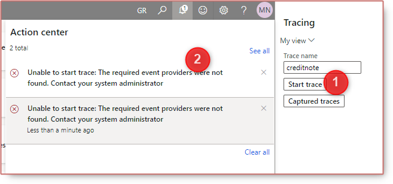
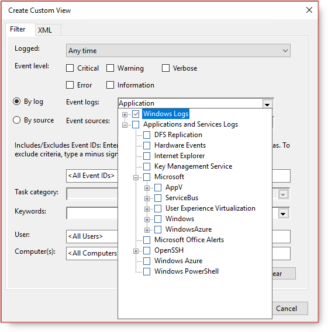
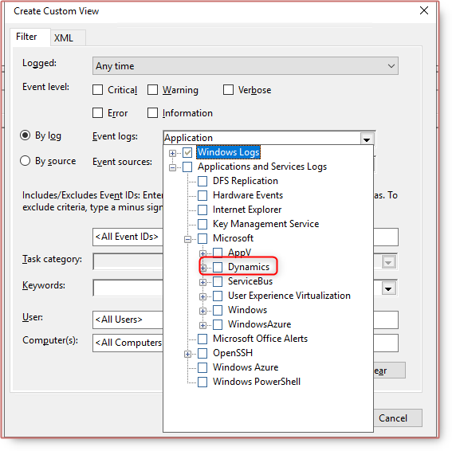

# Unable to start trace, the required event providers were not found. Contact your system administrator


The error pops when you start the trace: *Unable to start trace, the required event providers were not found. Contact your system administrator.*



Cause: Some how you dont have Dynamics in event viewer



Resolution: execute the script below under `C:\Temp` in powershell

```ps
$AOSSetupETWManifestDir = "K:\AosService\WebRoot\Monitoring"
foreach ($manifestFile in Get-ChildItem -Path $AOSSetupETWManifestDir\*.man | select-object -Property BaseName,Name)
{
    $dllFile=""
    if ((Test-Path "$AOSSetupETWManifestDir\$($manifestFile.BaseName).Instrumentation.dll"))
    {
        $dllFile = "$AOSSetupETWManifestDir\$($manifestFile.BaseName).Instrumentation.dll"
    }
    elseif ((Test-Path "$AOSSetupETWManifestDir\$($manifestFile.BaseName)Resource.dll"))
    {
        $dllFile = "$AOSSetupETWManifestDir\$($manifestFile.BaseName)Resource.dll"
    }
    elseif ((Test-Path "$AOSSetupETWManifestDir\$($manifestFile.BaseName).dll"))
    {
        $dllFile = "$AOSSetupETWManifestDir\$($manifestFile.BaseName).dll"
    }
    else 
    {
        Write-Host "Warn : Skipping $AOSSetupETWManifestDir\$($manifestFile.Name) as DLL not found"
        Continue    
    }
 
    Write-Host "Installing $AOSSetupETWManifestDir\$($manifestFile.Name) using $dllFile"
    wevtutil.exe im "$AOSSetupETWManifestDir\$($manifestFile.Name)" /rf:"$dllFile" /mf:"$dllFile"
    Write-Host "Finished installing $AOSSetupETWManifestDir\$($manifestFile.Name) `n`n"
}
```

Then restart the VM by LCS or Azure portal, you will get the Dynamics back in the event viewer and able to start the trace normally.



