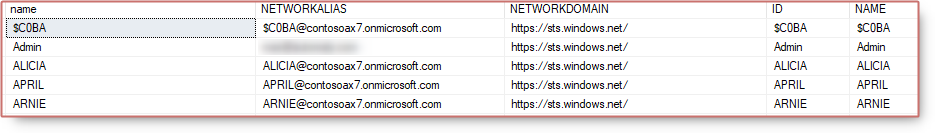
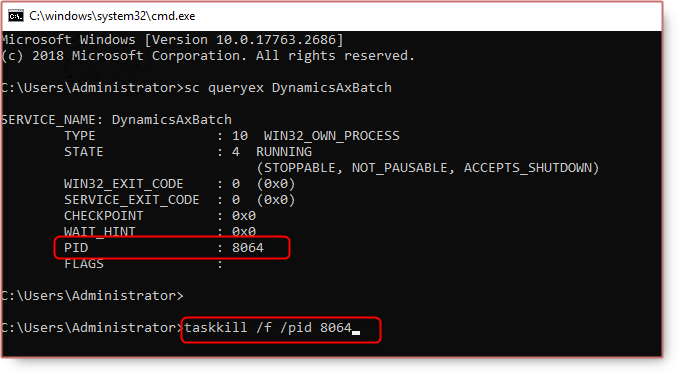

# Admin provisioning tools in Dynamics 365 Finance Operations

After restoring database backup, you want to be able to login to Dynamics 365 Finance Operations with different ternant, you need to use the admin provisioning tool to assign a new tenant.

From 10.0.24 verison, the admin provisioning tool can be found at

VHD: `C:\AOSService\PackagesLocalDirectory\bin\AdminUserProvisioning.exe`

Cloud- hosted: `K:\AOSService\PackagesLocalDirectory\bin\AdminUserProvisioning.exe`

After running `Provisioning.exe` wtih admin right, you will see the update for the admin user in SQL.

Some errors you might face:


Can not stop the DynamicsAXBatch service on computer



Execution Timeout Expired. The timeout period elapsed prior to completion of the operation or the server is not responding.



The remote server returned an error: (500) Internal Server Error.


Resolution, you can simply stop and start the services manually:

* World Wide Web Publishing Service
* Microsoft Dynamics 365 Unified Operations: Batch Management Service

Or you can restart VM using LCS or Azure portal.

If the issue **Can not stop the DynamicsAXBatch service on computer** still persist

You can kill the batch service using cmd:

1. Open CMD
2. `sc queryex DynamicsAxBatch`
3. `taskkill /f /pid 8064`

There is another error about Database


Cannot open database "AxDB" requested by the login. The login failed.
Login failed for user 'axdbadmin'.


Please this post for getting [VHD Database password](https://nuxulu.com/2020-04-06-getting-onebox-vhd-dynamics-365-finance-and-operations-virtual-machine/#2-rename-vm).

