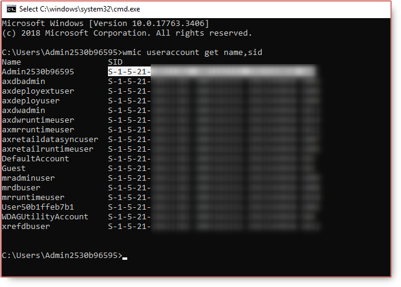
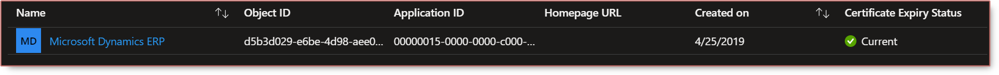

# Admin provisioning tools in Dynamics 365 Finance Operations


After restoring database backup, you want to be able to login to Dynamics 365 Finance Operations with different ternant, you need to use the admin provisioning tool to assign a new tenant.

<!--adsense-->

### Before 10.0.23 verison

The admin provisioning tool can be found at

VHD: `C:\AOSService\PackagesLocalDirectory\bin\AdminUserProvisioning.exe`

Cloud- hosted: `K:\AOSService\PackagesLocalDirectory\bin\AdminUserProvisioning.exe`

After running `Provisioning.exe` wtih admin right, you will see the update for the admin user in SQL.


Some errors you might face:


Can not stop the DynamicsAXBatch service on computer



Execution Timeout Expired. The timeout period elapsed prior to completion of the operation or the server is not responding.



The remote server returned an error: (500) Internal Server Error.


Resolution, you can simply stop and start the services manually:

* World Wide Web Publishing Service
* Microsoft Dynamics 365 Unified Operations: Batch Management Service

Or you can restart VM using LCS or Azure portal.

If the issue **Can not stop the DynamicsAXBatch service on computer** still persist

You can kill the batch service using cmd:

1. Open CMD
2. `sc queryex DynamicsAxBatch`
3. `taskkill /f /pid 8064`


There is another error about Database


Cannot open database "AxDB" requested by the login. The login failed.
Login failed for user 'axdbadmin'.


Please this post for getting [VHD Database password](/2020-04-06-getting-onebox-vhd-dynamics-365-finance-and-operations-virtual-machine/#2-rename-vm).

### From 10.0.23

From 10.0.23, the Admin user provisioning tool is removed due to security reasons, the reply URL setup for AAD was changed.
It is typically used to change the tenant of the environment. You can update the sign in information in the database for the Admin user or any other user. You only need the `SID` and `network alias` (email address) from a user that can access the environment or another environment on the same tenant.

To get the SID:

```ps
wmic useraccount get name,sid
```



Once you have admin SID, you can update the tenant in SQL by using.

```sql
select ID, SID, NETWORKALIAS from USERINFO where ID = 'Admin'

update USERINFO set SID = 'new_SID', NETWORKALIAS = 'new_NetworkAlias' where ID = 'Admin'
```

You might also got error


AADSTS50011: The reply URL specified in the request does not match the reply URLs configured for the application: '00000015-0000-0000-c000-000000000000'


Go to `C:\AOSService\webroot\web.config`, get `Aad.Realm`, `Aad.TenantDomainGUID`, `Infrastructure.HostUrl`

Run below script to add Dynamics 365  URL to ERP service principle application



```ps
$AADTenant = "xxxxxx-843a-434c-ae23-f8614106ac37"
$EnvironmentUrl = "https://xxxxxxxx.axcloud.dynamics.com"
$AADRealm = "00000015-0000-0000-c000-000000000000"

Connect-AzureAD

# Get Service Principal details
$SP = Get-AzureADServicePrincipal -Filter "AppId eq '$AADRealm'"

#Add Reply URLs
$SP.ReplyUrls.Add("$EnvironmentUrl")
$SP.ReplyUrls.Add("$EnvironmentUrl/oauth")

#Set/Update Reply URL
Set-AzureADServicePrincipal -ObjectId $SP.ObjectId -ReplyUrls $SP.ReplyUrls
```

If you are running VHD for the first time, please do this [task](/2020-04-06-getting-onebox-vhd-dynamics-365-finance-and-operations-virtual-machine/#61-register-a-new-application-in-azure-active-directory)




1. https://learn.microsoft.com/en-us/troubleshoot/azure/active-directory/error-code-aadsts50011-reply-url-mismatch

2. https://learn.microsoft.com/en-us/dynamics365/fin-ops-core/dev-itpro/dev-tools/access-instances#i-have-run-the-admin-user-provisioning-tool-on-my-development-environment-and-now-i-receive-the-following-sign-in-error-error-aadsts50011-the-reply-url-specified-in-the-request-does-not-match-the-reply-urls-configured-for-the-application




