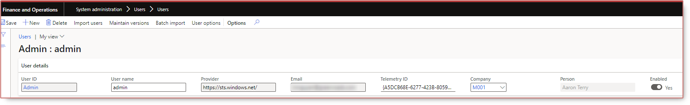

# Remove a person from an user Dynamics 365 Finance Operations

Whenever you add a new person to an user in the user **SysUserInfoPage** form, the person field grays out.

To remove the person from that user:

* In the user form `System administration > Users > Users`, go to `Maintain versions`.
* Delete the person.

