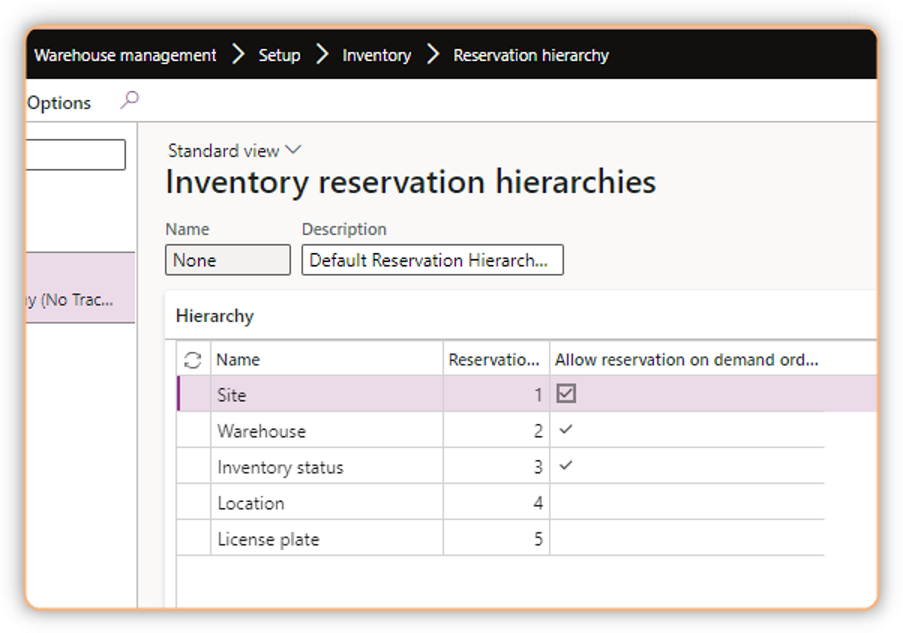
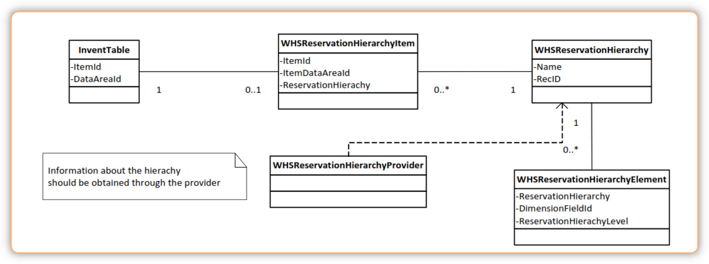
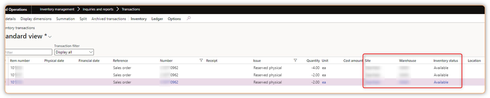
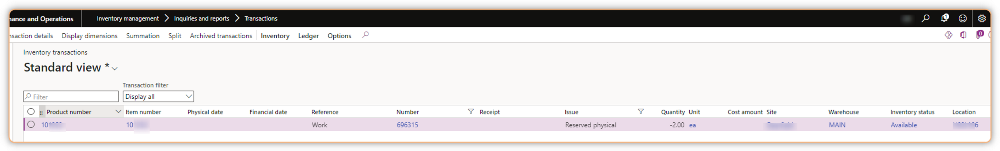
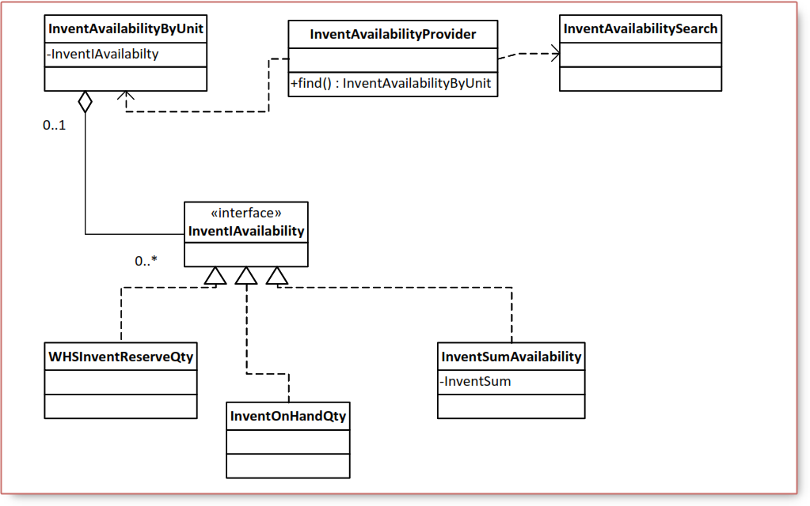
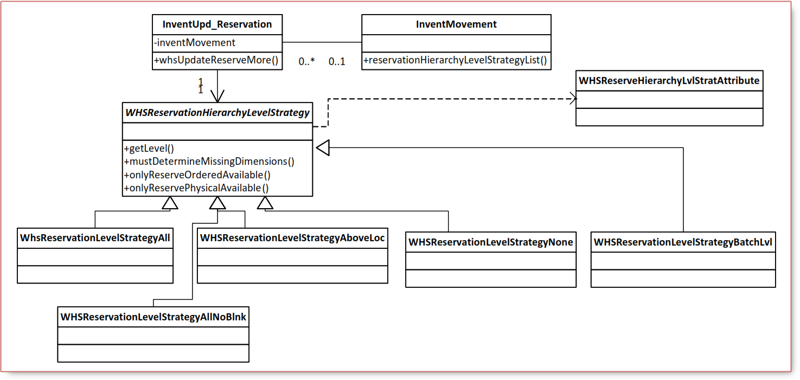

# Reservation and on-hand inventory in warehouse management


## 1. **Inventory reservation hierarchy in Warehouse management**

The reservation functionality can be used only for items that are enabled for warehouse management processes. However, if an item is itself enabled for [warehouse management processes](https://learn.microsoft.com/en-us/dynamics365/supply-chain/warehousing/flexible-warehouse-level-dimension-reservation), it can be used both in warehouses that are enabled for warehouse management processes and warehouses that are not. The behavior in reservation scenarios is different, depending on the warehouse setup.

The functionality is built on reservation hierarchies and is intended to support the following:

* Flexible warehouse operations.
* Postponement of reservation details.
* Clear separation of which inventory dimensions can be specified, and when they can be specified.

### 1.1 **Reservation hierarchies**

A typical reservation hierarchy for an item that uses the `Site`, `Warehouse`, `Inventory status`, `Location`, and `License plate` dimensions as physical inventory dimensions.



The level with the lowest value in the Reservation hierarchy level column is the least-specific level, in the example above this is the site level.
The higher the value, the more details are required to make a reservation on that level.

### 1.2 **Reservation hierarchies implementation**



The definitions of reservation hierarchies are stored in the **WHSReservationHierarchy** and **WHSReservationHierarchyElement** tables. These are shared tables. A reservation hierarchy can be associated with one item within a company which presents by **WHSReservationHierarchyItem**.
The **WHSReservationHierarchyProvider** class provides a large number of APIs that are useful when you work with and query the reservation hierarchy for an item.

### 1.3 Making reservations on different levels

Based on the reservation hierarchy, you can make reservations on different levels without providing details about where to reserve and what dimensions to reserve on. This lets you postpone specific details, such as the location or license plate to make the reservation. The location to reserve items on can be determined later by the [**location directive**](https://learn.microsoft.com/en-us/dynamics365/supply-chain/warehousing/warehouse-configuration).

As another example, you make reservations for a sales order created on **site** `Site1` and **warehouse** `WHS42`, which is a warehouse that is enabled for WHS processes, and for the Available inventory status. For this example, the reservation is made only
on the inventory status level.



Location `Main006` will be specified when processing the work



## 2. Impact of the reservation hierarchy setup

For warehouses that are enabled for warehouse management processes, the setup of reservation hierarchies greatly affects the processes for [outbound orders](https://learn.microsoft.com/en-us/dynamics365/supply-chain/warehousing/release-to-warehouse-process), such as sales orders and transfer orders.

When you set up a reservation hierarchy, the key is to determine which dimensions should be positioned above the location level in the hierarchy, and which should be below. The following table describes the effects of arranging dimensions either above or below the location level.

| Dimension placement       | Description                                                                               |
|---------------------------|-------------------------------------------------------------------------------------------|
| Dimension above location  | The inventory dimension above the location level must be determined before the            |
|                           | Warehouse management functionality can be used. Therefore, this typically happens         |
|                           | during order processing or by letting the reservation system determine the dimensions.    |
| Batch above location      | Process industry functionality for batches requires that the Batch number dimension be    |
|                           | above the Location dimension in the reservation hierarchy. When this is the case, all     |
|                           | functionality for First Expiry First Out (FEFO), same batch, batch disposition codes, and |
|                           | batch attributes is supported.                                                            |
| Dimensions below location | WHS and warehouse workers can determine the Location dimension and the                    |
|                           | dimensions below it.                                                                      |
|                           |                                                                                           |
|                           | The Location dimension and any dimensions below it should not be entered into the sales   |
|                           | and transfer lines if you expect work to be created. For example, if the Batch number     |
|                           | dimension is below the Location dimension, it should not be specified on the sales line.  |
|                           | Otherwise, WHS cannot create work to carry out the pick and pack operations.              |

## 3. On-hand representation and calculations

### 3.1 On-hand for items that are using warehouse management processes

The following table shows how the data might look for an item with 10 pieces available physical and 2 pieces reserved physical on the status level.

| Level         | Site | Warehouse | Inventory status | Location | License plate | Available physical | Available ordered | Reserved physical | Reserved ordered |
|---------------|------|-----------|------------------|----------|---------------|--------------------|-------------------|-------------------|------------------|
| Item          |      |           |                  |          |               | 10                 | 10                | 2                 | 0                |
| Site          | S1   |           |                  |          |               | 10                 | 10                | 2                 | 0                |
| Warehouse     | S1   | WH1       |                  |          |               | 10                 | 10                | 2                 | 0                |
| Status        | S1   | WH1       | Available        |          |               | 10                 | 10                | 2                 | 0                |
| Location      | S1   | WH1       | Available        | L001     |               | 12                 | 12                | 0                 | 0                |
| License plate | S1   | WH1       | Available        | L001     | LP1           | 12                 | 12                | 0                 | 0                |

The reservations are tracked only on the levels that are affected by the reservation. Because of the way that information about availability and reservations is stored, the corresponding values from the **InventSum** table cannot be used directly for items that are using warehouse management processes.

The following steps provide a high-level overview of the algorithm that determines the available on-hand quantity for
an item and a set of inventory dimensions:

* Determine the available on-hand quantity, based on the exact dimensions. This is the lowest level in the hierarchy.
* Determine the smallest available quantity from all levels above the level found in step 1.
* Return the smaller of the quantities found in step 1 and step 2. This is the available quantity.

#### Example A

The following physical inventory exists for the item (some dimensions like site, inventory status, license plate are irrelevant and are omitted throughout the scenario):

* *Warehouse: W1, Location: L1, Physical inventory: 6*

A sales order with one line is created and reserved:

* *Warehouse: W1, Quantity: 5*

The sales order is released to warehouse. As a result warehouse work is created:

* *Work type: Pick, Warehouse: W1, Location: L1, Quantity: 5*
* *Work type: Put, Warehouse: W1, Location: Baydoor, Quantity: 5*

Now we have the following inventory transactions:

| Reference  | Warehouse | Location | Status issue      | Quantity |
|------------|-----------|----------|-------------------|----------|
| Sales line | W1        |          | Reserved physical | -5       |
| Pick work  | W1        | L1       | Reserved physical | -5       |
| Put work   | W1        | Baydoor  | Ordered           | 5        |

So once we roll up the transactions into the **InventSum** table the contents of the table will look like this

| Warehouse | Location | Physical inventory | Reserved physical | Available physical | Ordered |
|-----------|----------|--------------------|-------------------|--------------------|---------|
| W1        |          | 0                  | 5                 | -5                 | 0       |
| W1        | L1       | 6                  | 5                 | 1                  | 0       |
| W1        | Baydoor  | 0                  | 0                 | 0                  | 5       |

On hand quantities for warehouse W1 like we used to do it in versions prior to AX 2012 R3 (sum up InventSum quantities for warehouse W1)

| Warehouse | Physical inventory | Reserved physical | Available physical | Ordered |
|-----------|--------------------|-------------------|--------------------|---------|
| W1        | 6                  | 10                | -4                 | 5       |

We should have shipped 5 items and we have 6 items on stock, 1 item is available. This is exactly the reason why summing up available and reserved quantities from the **InventSum** table may produce incorrect results for items that use warehouse management processes.

The sales reservation was taken on the warehouse level of the reservation hierarchy to ensure that we keep enough on hand in the warehouse to ship the reserved quantity. The pick work reservation was taken on the location level and it ensures that the reserved quantity will still be physically available when the warehouse worker comes to the warehouse location to pick it. Work reservation does not affect physical availability on the warehouse level. This means that the new reservation engine will be able to figure out that we still have one item available on the warehouse level.

| Warehouse | Physical inventory | Reserved physical | Available physical | Ordered |
|-----------|--------------------|-------------------|--------------------|---------|
| W1        | 6                  | 5                 | 1                  | 5       |

#### Example B

| Reference     | Warehouse | Location | Status issue      | Status receipt | Quantity |
|---------------|-----------|----------|-------------------|----------------|----------|
| Purchase line | W1        | L1       |                   | Purchased      | 10       |
| Purchase line | W1        | L2       |                   | Purchased      | 20       |
| Sales line    | W1        |          | Reserved physical |                | -25      |
| Pick work     | W1        | L1       | Reserved physical |                | -10      |
| Put work      | W1        | Baydoor  | Ordered           |                | 10       |

After the transactions are aggregated the **InventSum** table contains the following information

| Warehouse | Location | Physical inventory | Reserved physical | Available physical | Ordered |
|-----------|----------|--------------------|-------------------|--------------------|---------|
| W1        |          | 0                  | 25                | -25                | 0       |
| W1        | L1       | 10                 | 10                | 0                  | 0       |
| W1        | L2       | 20                 | 0                 | 20                 | 0       |
| W1        | Baydoor  | 0                  | 0                 | 0                  | 10      |

For each of the levels of the reservation hierarchy it stores available and reserved quantities in the `WHSInventReserve` table which allows the engine to calculate availability correctly.

To work with available quantities regardless of whether the item is using warehouse management processes or not the `InventIAvailability` interface was introduced. The following list contains the InventSum fields and methods that should not be used directly and the corresponding InventIAvailability methods that should be used instead:

| Obsolete field/method               | Corresponding InventIAvailability method |
|-------------------------------------|------------------------------------------|
| InventSum.AvailOrdered              | InventIAvailability.availTotal()         |
| InventSum.availOrderedCalculated()  | InventIAvailability.availTotal()         |
| InventSum.AvailPhysical             | InventIAvailability.availPhysical()      |
| InventSum.availPhysicalCalculated() | InventIAvailability.availPhysical()      |
| InventSum.availReservation()        | InventIAvailability.availReservation()   |
| InventSum.Ordered                   | InventIAvailability.ordered()            |
| InventSum.orderedSum()              | InventIAvailability.orderedSum()         |
| InventSum.ReservOrdered             | InventIAvailability.reservOrdered()      |
| InventSum.ReservPhysical            | InventIAvailability.reservPhysical()     |

### 3.2 Implementation of on-hand calculations

Three major APIs were introduced for retrieving item availability:

– `InventAvailabilityProvider`
– `InventAvailabilityFormCache`
– `InventOnhand`

* **InventAvailabilityProvider**

```C#
InventIAvailability  inventIAvailability = InventAvailabilityProvider::findByItemDim(
                                            InventTable::find(itemdId), dim).parmInventAvailability();

Info(strFmt("inventIAvailability, availPhysical %1, ordered %2, reservPhysical %3, reservOrdered %4", 
                inventIAvailability.availPhysical(), 
                inventIAvailability.ordered(), 
                inventIAvailability.reservPhysical(), 
                inventIAvailability.reservOrdered()));

InventAvailabilityByUnit inventAvailabilityByUnitSum = InventAvailabilityProvider::findByItemSumDim(
                                                        InventTable::find(itemdId), inventSum, dim);

Info(strFmt("inventAvailabilityByUnitSum, availPhysical %1, ordered %2, reservPhysical %3, reservOrdered %4", 
                inventAvailabilityByUnitSum.availPhysical().qty(false), 
                inventAvailabilityByUnitSum.ordered().qty(false), 
                inventAvailabilityByUnitSum.reservPhysical().qty(false), 
                inventAvailabilityByUnitSum.reservOrdered().qty(false)));
```

* **InventAvailabilityFormCache**

In scenarios where you want to display available quantities on a form you can use the InventAvailabilityFormCache class.
It is responsible for retrieving and caching available on hand quantities per item per inventory dimension combination. To use it on a form you need to:

– Declare an `InventAvailabilityFormCache` field in `classDeclaration` of the form.
– Initialize the cache field in the `init` method of the form:

```C#
public void init()
{
    super();
    inventAvailabilityFormCache = InventAvailabilityFormCache::construct();
}
```

– Flush the cache in the `executeQuery` method of the primary data source that the `InventSum` data source is joined to:

```C#
public void executeQuery()
{
    inventAvailabilityFormCache.refreshCache();
    super();
}
```

– Create display methods for available on hand fields that need to be displayed on the form. If `InventDim` is joined to `InventSum` then the display methods should be declared on the `InventSum` data source:

```C#
public display InventQtyReservPhysical reservPhysical(InventSum _inventSum)
{
    return inventAvailabilityFormCache.availabilityFromSumJoinedWithDim(_inventSum, inventDim_ds).reservPhysical();
}
```

Note that the `availabilityFromSumJoinedWithDim` method should be used. Otherwise, if `InventSum` is joined to InventDim then the display method should be declared on the `InventDim` data source:

```C#
public display InventQtyReservPhysical reservPhysical(InventDim _inventDim)
{
    return inventAvailabilityFormCache.availabilityFromDimJoinedWithSum(_inventDim, inventSum_ds).reservPhysical();
}
```

Note that the `availabilityFromDimJoinedWithSum` method should be used.

* **InventOnhand**

```C#
InventOnhand inventOnHand = InventOnhand::newParameters(itemdId, dim , dimParm);
Info(strFmt("inventOnHand, availPhysical %1, ordered %2, reservPhysical %3, reservOrdered %4", inventOnHand.availPhysical(), inventOnHand.ordered(), inventOnHand.reservPhysical(), inventOnHand.reservOrdered()));
```

The on-hand information is stored in a table called `WHSInventReserve`. The `WHSInventReserveDelta` table is used to track changes that the current transaction causes in the on-hand quantity. On the final commit, the `WHSInventReserve` table is updated based on the changes in the `WHSInventReserveDelta` table.

Because many scenarios involve calculating on-hand quantities based on `itemId`, `InventDim`, or `InventSum` records for
both WHS-enabled and non-WHS-enabled items, APIs are provided to support the calculations in a seamless way.

The following example shows how to instantiate the class that can be used to calculate availability for both WHSenabled and non-WHS-enabled items.

```C#
InventAvailabilitySearch availabilitySearch;
InventIAvailability availability;

availabilitySearch = InventAvailabilitySearch::construct();
availabilitySearch.setItemId(_itemId);
availabilitySearch.setInventDimCriteria(_inventDimCriteria, _inventDimCriteriaParm);
availabilitySearch.setInventSum(_inventSum);
availability = InventAvailabilityProvider::construct().find(availabilitySearch).parmInventAvailability();

this.AvailOrderedCalculated         = availability.availTotal();
this.AvailPhysicalCalculated        = availability.availPhysical();
this.ReservPhysical                 = availability.reservPhysical();
this.OrderedSum                     = availability.orderedSum();
```

The `InventAvailabilityProvider` class provides numerous other APIs that are used to determine the availability based on various types of input. The existing `InventOnHandQty` class has been updated so that it also provides correct results for items that are enabled for warehouse management processes.

The following illustration shows the various classes and interfaces that are used to provide and encapsulate the calculations. Note that, for the sake of simplicity, some details have been omitted.



## 4. Reservation strategies

To control the levels of the reservation hierarchy at which reservations are made, the system uses the concept of a reservation strategy. A reservation strategy determines the outcome of a reservation, and the dimensions that are used to make the reservation. Reservation strategies are implemented in the code and are not currently user-configurable.

Each reservation strategy determines the level that the reservation should be made on. If the dimensions that are passed to the reservation system do not cover all the dimensions to the level defined by the strategy, the reservation system queries the on-hand availability until the required level; then, based on the results of this query, it does the reservation so that it covers all the required dimensions.

The reservation strategies that are chosen for a reservation depend on multiple factors, such as the following:
• Warehouse setup
• Order type

The following table describes the reservation strategies that the reservation system uses.

| Reservation strategy   | Description                                                                                                      |
|------------------------|------------------------------------------------------------------------------------------------------------------|
| None                   | The reservation is made on the dimensions that are passed, if possible. This strategy is                         |
|                        | used by inventory blocking, and lets you make reservations on, for example, the site                             |
|                        | level or the warehouse level.                                                                                    |
| All                    | The reservation is made on all of the dimensions in the reservation hierarchy. This                              |
|                        | strategy is used, for example, for transfer journals, or for warehouses that have not                            |
|                        | been enabled for warehouse management processes.                                                                 |
| Above location         | The reservation is made only on the locations above the location level. This strategy is                         |
|                        | used, for example, for sales and transfer orders when reservations are made in a                                 |
|                        | warehouse that is enabled for warehouse management processes.                                                    |
| All not allowed blank  | The reservation is made on the first lowest level that does not allow for blank issue for                        |
|                        | the inventory dimensions. This strategy enables automatic reservations on non-licenseplate-controlled locations. |
| Batch level            | This strategy is applied for items for which the Batch number dimension is selected and                          |
|                        | positioned above the Location dimension in the reservation hierarchy. This strategy is                           |
|                        | used when only reservations that are reserved ordered can be made. In that case, a                               |
|                        | reservation until the batch level is attempted.                                                                  |

The reservation system supports multiple reservation strategies in sequential order when reservations are made. For example, the system uses the All and All not allowed blank strategies to make reservations for transfer journals.

## 5. Details about the implementation of reservation strategies

The following illustration shows the classes that are used to implement the reservation strategies, and the main consumers of the classes. Note that, for the sake of simplicity, some details have been omitted.



The implementation is easy to extend, because the instantiation uses the `SysExtension` framework.

## 6. Synchronization of dimensions between receipts and issues

When an inventory transaction is marked or reserved ordered, the inventory dimensions are typically synchronized between *receipts* and *issues*. For example, when a purchase order that was created based on a sales order is modified or received, the dimensions are transferred to the inventory transactions for the sales line.

For items that are enabled for warehouse management processes, the synchronization differs from the standard behavior. When work must be created, the source line transactions can be reserved only until the level above the location level. If all dimensions are synchronized, work cannot be created. Therefore, dimensions above the location level are not synchronized for all scenarios.

If the item and warehouse are enabled for warehouse management processes, and if the issue type is a type that can generate work, such as a sales line, only dimensions above the location level are synchronized. This means that if an item uses batch numbers, and the batch number is placed below the location in the reservation hierarchy, the batch number is not synchronized from receipt to issue transactions.

## 7. Details about the implementation of synchronization between receipts and issues

The logic that determines how the dimensions are synchronized is implemented in the following methods on the **inventMovement** class:

* `getInventDimForReservedTransPhysChange`
* `getInventDimForIssueTransFromReceipt`

