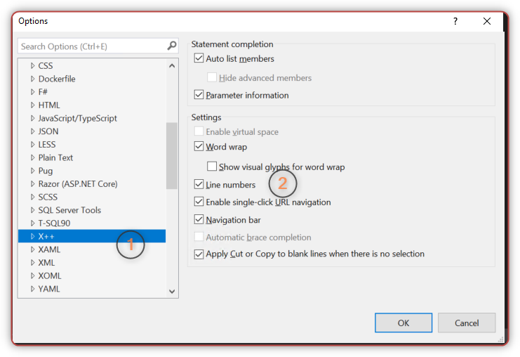
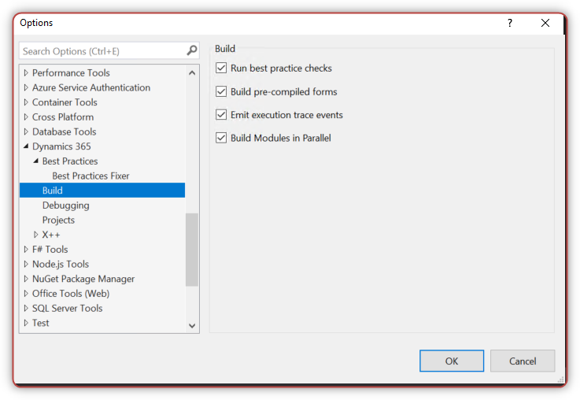
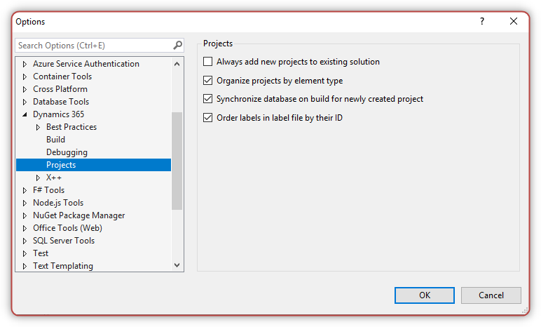
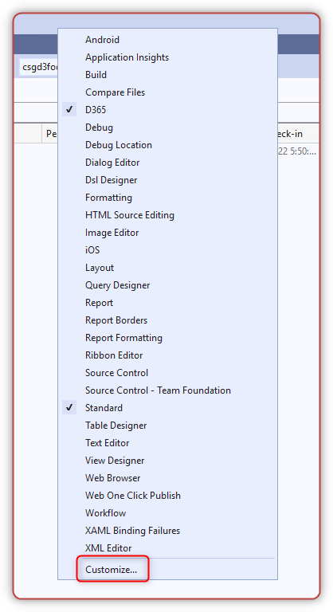
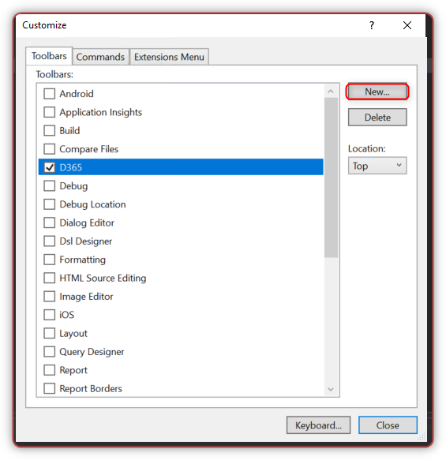
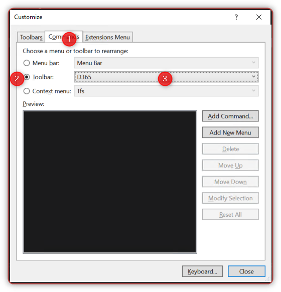
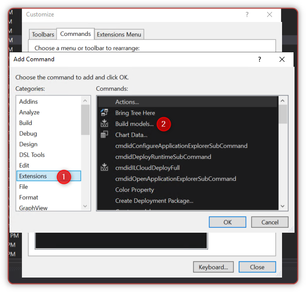
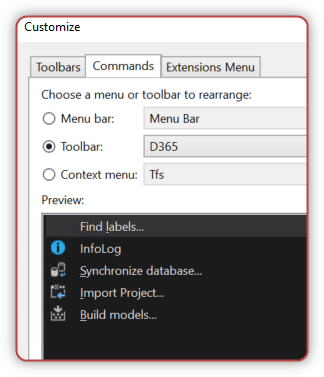
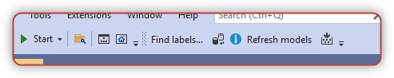

# Visual Studio Tips for Dynamics 365 Finance Operations

Some configurations that you should make for Visual studio in newly deplopyed FinOps environments.

## 1. Show line number

* Open Visual studio as Administrator right.
* Click on the **Dynamics 365** drop down menu on the toolbar and select *Options*.
* Text editor -> X++

## 2. Best practice rules

* Click on the **Dynamics 365** drop down menu on the toolbar and select *Options*.
* In **Dynamics 365**, select *Best Practices* and select each of the following:
  * Microsoft.Dynamics.AX.Framework.BestPracticeFramework.UIRules
  * Microsoft.Dynamics.AX.Framework.CodeStyleRules
  * Microsoft.Dynamics.AX.Framework.DataAccessRules
  * Microsoft.Dynamics.AX.Framework.DataEntityRules
  * Microsoft.Dynamics.AX.Framework.DataMethodRules
  * Microsoft.Dynamics.AX.Framework.DepreciatedElementsRules
  * Microsoft.Dynamics.AX.Framework.MaintainabilityRules
  * Microsoft.Dynamics.AX.Framework.StaticCodeValidationRules

## 3. Build

If you want to lower building time

* Click on the **Dynamics 365** drop down menu on the toolbar and select *Options*.
* In **Dynamics 365**, select *Build* and select *Build Modules in Parallel*

[More information on this feature](https://community.dynamics.com/365/financeandoperations/b/peter-s-x-developer-blog/posts/visual-studio-s-parallel-compilation-flag)

## 4. Projects

* Click on the **Dynamics 365** drop down menu on the toolbar and select *Options*.
* In **Dynamics 365**, select *Build* and select
  * Organize projects by element type
  * Synchronize database on build for newly created project
  * Order labels in label file by their ID

## 5. Customize toolbars

* Right click on Toolbars, choose *Customize*

* Create a new toolbar named **D365**

<!--  -->

* Switch to **Commands** tab, Choose **D365** in Toolbar

* Choose **Add Command** -> **Extensions** -> Add commands that you want

Here are my favorites

Now you can access them directly from toolbars, it will save you some clicks.

