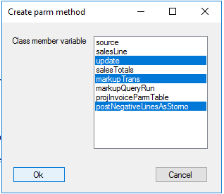
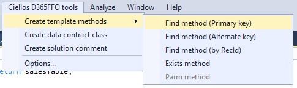
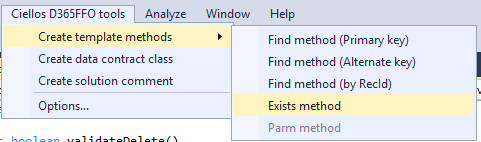
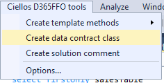
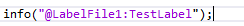
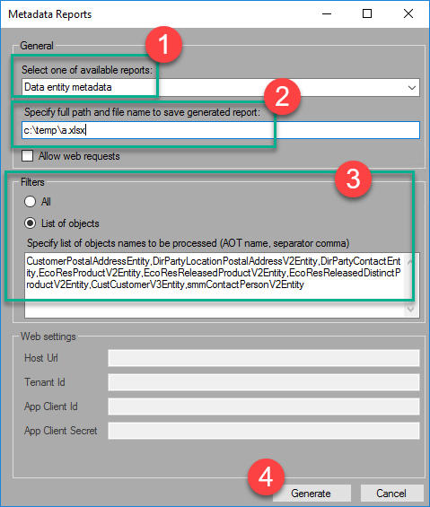
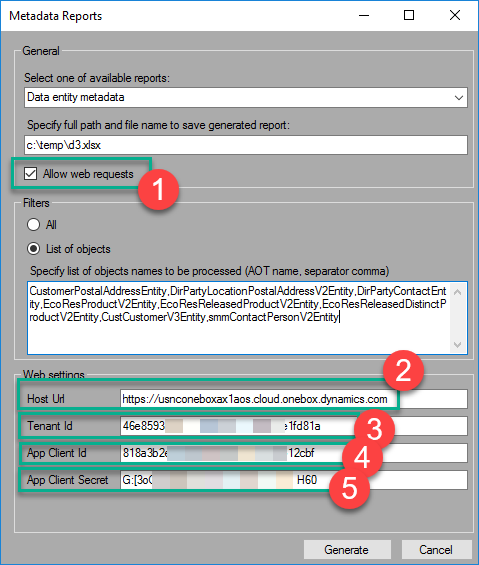

# Ciellos Developer Toolbox for D365 F&O - User Guide

- [1. **Development tools menu**](#1-development-tools-menu)
- [2. **Development tools options**](#2-development-tools-options)
- [3. **Development tools**](#3-development-tools)
  - [3.1. **Create methods from template**](#31-create-methods-from-template)
    - [3.1.1. **Create parm – method**](#311-create-parm--method)
    - [3.1.2. Create a find method for tables for primary key](#312-create-a-find-method-for-tables-for-primary-key)
    - [3.1.3. Create find method for tables for alternate key](#313-create-find-method-for-tables-for-alternate-key)
    - [3.1.4. Create exist method for tables](#314-create-exist-method-for-tables)
- [4. **Create a Data Contract class from JSON**](#4-create-a-data-contract-class-from-json)
- [5. **Create task comment**](#5-create-task-comment)
- [6. **Create a label**](#6-create-a-label)
- [7. **AOT Tools**](#7-aot-tools)
- [8. **Metadata Reports**](#8-metadata-reports)
- [9. **Data Entity Metadata**](#9-data-entity-metadata)
- [10. **Configuration – Simple mode**](#10-configuration--simple-mode)
- [11. **Configuration – Adding real data**](#11-configuration--adding-real-data)

**Summary**

These tools will be used in the Visual Studio development environment for improving development. Using these tools will reduce tedious processes and the productivity of developers will be increased. These tools will be applied only for Dynamics 365 for Finance and Operations (D365FFO) development framework.

**About Ciellos**
###### 0.0.0.0.0.1. 0.0.0.At Ciellos, we advise and guide customers and partners in Business Systems Change, Cloud Infrastructure and Systems Implementation/Deployment, Solution Development, Migrations and Upgrading, and Ongoing Support, focusing on Microsoft Dynamics and Azure. For software vendors, our services include developing and managing products and integrations to Microsoft Dynamics, with a focus on systems sustainability and rapid go-to market response.
###### 
###### 0.0.0.0.0.2. We welcome the opportunity to learn more about your business and present options on how best to collaborate and assist with your business transformation plans. Connect with us via <info@ciellos.com> or find more information online at [www.ciellos.com](http://www.ciellos.com).
###### 0.0.0.0.0.3. **​**
**We focus on Microsoft Dynamics Technologies**​

- Dynamics 365 for Finance and Operations, Retail, Talent
- Dynamics 365 Customer Engagement (Sales, Customer Service, Field Service, PSA, Marketing)
- Dynamics 365 Business Central
- Dynamics AX | NAV | CRM (All Versions)
- Power Platform (Power Apps, Power BI, Power Automate, AI Builder)
- Azure, Azure Logic Apps, Azure DevOps, Azure Micro Services
- Common Data Services (CDM/CDS/CDA) 
- Customer and Product Insights

# 1. **Development tools menu**
Dropdown menu with tools set appeared in Visual studio main menu after Dynamics 365 menu item. This menu item has ‘Ciellos D365FFO tools’

Each tool represented as a menu item drop-down menu.  Additionally, tools could be called from the user interface from the context menu. If features can’t be used in the current context menu item with this tool can be disabled.

# 2. **Development tools options**
Ciellos Development tools parameters are called from the ‘Options’ menu item from the Ciellos D365 Tools menu. Standard ‘Options’ form from Visual Studio is displayed in this case.

User can enable or disable a tool that will be used in Visual Studio.
# 3. **Development tools**
## 3.1. **Create methods from template**
### 3.1.1. **Create parm – method**
   
This tool generates a standard parm method for the current class.

Prerequisites:

- The solution must be opened;
- The current window must be code view for one of the classes from solution;

If any of the prerequisites won’t fit corresponding error message will pop up.

The tool could be opened from the ‘Ciellos D365FFO Tools’ menu and context menu of the code view window.

Example of context menu below

After choosing the Parm - method tool dialog form will open.

Class variables are retrieved from open class. Developer could select one or more variables and the parm method will be created for each of them. Method parameter type and type that method returns will be obtained from the class variable declaration.

Parm method will be created like in the picture below.

### 3.1.2. Create a find method for tables for primary key
This tool generates a standard find method for the D365FFO table. 

Prerequisites:

- The solution must be opened;
- The current window must be code view for table element from AOT;

If any of the prerequisites won’t fit running of this tool shouldn’t be available.

The tool could be opened from the ‘Ciellos D365FFO Tools’ menu and context menu of the code view window.

Example of context menu below

X++ code will be created in the code window after choosing a menu item.

The procedure analyzes the primary key of this table and creates input parameters of find method regarding primary key. 

If the surrogate key used as primary key find method will be created by RecId.
### 3.1.3. Create find method for tables for alternate key
The functionality of this tool will be almost the same as for the primary key but the alternate key will be used to find method creation.
### 3.1.4. Create exist method for tables 
This tool generates a standard exist method for the D365FFO table. 

Prerequisites:

- The solution must be opened;
- The current window must be code view for table element from AOT;

If any of the prerequisites won’t fit running of this tool shouldn’t be available.

The tool could be opened from the ‘Ciellos D365FFO Tools’ menu and context menu of the code view window.

Please find the example of context menu below

X++ code will be created in the code window after choosing a menu item.

The procedure analyzes the primary key of this table and creates input parameters of exist method regarding the primary key. 

If the surrogate key used as primary key exist method will be created by RecId.
# 4. **Create a Data Contract class from JSON**
This tool can be called only from the top-level menu. It generates standard X++ Data Contract class (or several classes) with variables and park methods by the JSON example. This class will be inserted into the current project/solution. If no open project/solution create the error message “Solution/project should be opened”

This tool is running from the ‘Ciellos D365FFO Tools’ menu

Tool processing is created in wizard style. Processing performs several steps:

- Step 1: Enter startup parameters;
- Step 2: Preview class structure that will be created. Possibilities to change parameters
- Step 3: Data contract class creation

Form for the first step showed below

This tool could create one or more Data Contracts classed in depends on the structure of JSON. The name of the base (top-level) class will be populated in the ‘Base class name’ field. When developer press Next content of the ‘JSON’ field will be analyzed and the structure of classes will be created.

Form for setup 2 showed below

Parsed JSON is represented in a tree view. Here could be two types of elements: Classes and Attributes. If the element type is ‘Class’ class will be created in the current solution. If the element type is ‘Attribute’ – class member variable will be created and correspondent parm – a method for class member variable will be created.

We have several parameters for all elements

- **Create** –applied for both element types. If value equals True – element will be created; Otherwise – element will be skipped. This value is True by default. 
- **Name** –applied for both element types. If this is a class element here will be the class name. For root class value populates from the ‘Root class name’ field from step If this is an attribute element – here will be class member variable name. Change this value is allowed to the user. 
- **Type** –applied only for the attributes element type. This value could be initially populated from data mapping parameters. The type could be modified by a developer. Here is used D365FFO EDT or Enum type.

Form in step 3 presented below

Code of class or classes will be created after pressing the ‘Finish’ button
**Initial mapping**
Initial mapping for types that receive from JSON to D365FFO types are in VS Options

# 5. **Create task comment**
This tool generates comments for code for D365FFO elements (classes, tables, forms, etc ). This comment includes the solution name, developer name, modification date.

Prerequisites:

- The solution must be opened;
- The current window must be code view for classes, forms, tables, SSR reports elements from AOT;

If any of the prerequisites won’t fit running of this tool shouldn’t be available.

The tool could be opened from the ‘Ciellos D365FFO Tools’ menu and context menu of the code view window.

The following window will be opened after choosing the menu item

The solution name field is populated with the name of the current solution.

The developer name field is populated with the name of the developer from the VS account.

The developer field in comment template could set up a template of the newly created comment.

Here is a possibility to change all four fields. 

Comment in X++ code will be created after pressing the OK button.

# 6. **Create a label**
This tool generates or inserts labels to the label file from the X++ code for D365FFO elements (classes, tables, forms, etc ). 

Prerequisites:

- The solution must be opened;
- The current window must be code view for classes, forms, tables, SSR reports elements from AOT;
- The text should be selected

If any of the prerequisites won’t fit running of this tool shouldn’t be available.

The tool could be used after choosing a menu item.

The label is created in label files from the current project model. If there is more then one label file, it will be opened dialog form with a list of label files, where could be created label.

The text will be changed using the label id.

# 7. **AOT Tools**
For AOT are created some manipulation tools:

- Copy Name
- Copy AOT Path
- Copy File Path
- Create CoC

The tool could be used after choosing a menu item.

Copy Name – copy the name of the AOT element.
Copy AOT Path - copy path of the element from AOT. Example: AOT/Data Model/Tables/SalesTable
Copy File Path - copy the local path of the element from the AOS folder. Example: C:\AOSService\PackagesLocalDirectory\ApplicationSuite\Foundation\AxTable\SalesTable.xml
Create CoC – the functionality for the class extension, or class augmentation, using Chain of Commands.

**Create CoC**
   
This tool generates a class for D365FFO elements (classes, tables, forms, etc. ), using the CoC principle. 

The tool could be used after choosing a menu item.

Class and X++ Code will be created in the code window after choosing a menu item.

**ERD Diagram**
This tool generates ERD Diagram flow for visualization of table relations.

The tool could be used after choosing a menu item.

After menu item selection will be showed dialog with parameters:

- Depth – table relation depth (warning: tool can freeze VS if the depth is too large).
- Show country region fields – visibility of country region fields.
- Show deleted fields - visibility of deleted fields with prefix ‘DEL\_’.
- Show Table inheritance – show tables that inherited (used dotted line).

Example:

ERD Diagram can be saved selecting menu item ‘Save as’ from the context menu (right mouse click).

And diagram can be saved only as an image.

# 8. **Metadata Reports**
   

For now, we have only one report – Data Entity metadata

# 9. **Data Entity Metadata**
   

This report contains a description of each specified Data Entity. Description means, a list of fields with details, like data type, Label, Data source, and other metadata.

This report is good to use in Integration projects.

This report will generate data for any custom or extended Data Entities. 

# 10. **Configuration – Simple mode**

For simple mode, you should specify the following

- **Report type**. Select “Data entity metadata”
- **Specify an Excel file name with the full path**, like “c:\temp\a.xlsx”
- Specify a filter
  - **All** – Will generate a report on all data entities. Please note that it may take a while.
  - **List of objects** – Will generate a report against provided data entities. For example, “CustomerPostalAddressEntity,DirPartyLocationPostalAddressV2Entity,DirPartyContactEntity,EcoResProductV2Entity,EcoResReleasedProductV2Entity,EcoResReleasedDistinctProductV2Entity,CustCustomerV3Entity,smmContactPersonV2Entity”
- Click on **Generate** button
- You may enrich the metadata report by adding examples of the data from a real environment. To do this, you should enable web requests. The report generator will call OData endpoints and get the first 3 lines for each Data Entity. Then these values will be inserted to the grid as Value 1, Value 2, Value 3 columns and as JSON example on the bottom on the report page.
  
# 11. **Configuration – Adding real data**
   
You may enrich the metadata report by adding examples of the data from a real environment. To do this, you should enable web requests. The report generator will call OData endpoints and get the first 3 lines for each Data Entity. Then these values will be inserted to the grid as Value 1, Value 2, Value 3 columns and as JSON example on the bottom on the report page.

First of all, you should enable “Allow web requests”, then provide the following information

- **Host URL**. URL of you D365FO instance, like “https://usnconeboxax1aos.cloud.onebox.dynamics.com”
- **Tenant Id**. Your tenant Id, GUID code.
- **App Client Id**, Azure Application Client Id, GUID code.
- **App Client Secret**, Azure Application secret key, like a password.

Before generating a report with data examples, you should enable this Azure Application Id on the D365FO side, on the form System Administration à Setup à Azure Active Directory applications

Please find more information on how to create Azure Application here <https://vmoskalenkoblog.wordpress.com/2018/06/25/reading-odata-from-dynamics-365/>

Copyright © 2019 Ciellos Inc.

