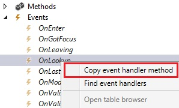

# Override Form Control Lookup


## Scenario

In FreeText invoice form, create a lookup invoice list of current customer in the freeText invoice line.  

### **Copy Event Handler method:**

I created a string control for the new field and want to override `OnLookup` event.  Under the form control, go to `Events > OnLookup > right click > Copy event handler method`.
  


## Event Handler Class

Create a class to project and paste code.  It will create a method with `FormControlEventType::Loopup`. This lookup will be used in another form.  So, I create another extension class sending the `FormControl`, its `EventAgrs` and `InvoiceAccount` as parameters.

```c#
/// <summary>
/// Handles events raised by <c>CustFreeInvoice</c> form.
/// </summary>
[ExtensionOf(FormStr(CustFreeInvoice))]
final public class MAX_CustFreeInvoiceEventHandler_Extension
{
    /// <summary>
    /// Adds a lookup to the <c>RefInvId</c> control on <c>CustInvoiceLine</c> form.
    /// </summary>
    /// <param name="_sender">The source of the event.</param>
    /// <param name="_e">Arguments of the OnLookup event.</param>
    [FormControlEventHandler(formControlStr(CustFreeInvoice, CustInvoiceLine_RefInvId), FormControlEventType::Lookup)]
    public static void CustInvoiceLine_MAX_RefInvId_OnLookup(FormControl _sender, FormControlEventArgs _e)
    {
        FormRun                 form = _sender.formRun();
        FormDataSource          custInvoiceTable_ds = form.dataSource(formDataSourceStr(CustFreeInvoice, CustInvoiceTable)) as FormDataSource;
        CustInvoiceTable        custInvoiceTable = custInvoiceTable_ds.cursor(); 

        MAX_CustInvoiceTable_Extension::lookup_RefInvId(_sender, _e, custInvoiceTable.InvoiceAccount);
    }
}
```

Extend **CustInvoiceTable_Extension** class

```c#
/// <summary>
/// Method extension for <c>CustInvoiceTable</c> table.
/// </summary>
public static class MAX_CustInvoiceTable_Extension
{
    /// <summary>
    /// Adds an InvoiceId lookup from CustInvoiceJour.
    /// </summary>
    /// <param name="_sender">The source of the event.</param>
    /// <param name="_e">Arguments of the OnLookup event.</param>
    [SysClientCacheDataMethodAttribute(true)]
    public static void lookup_RefInvId(FormControl _sender, FormControlEventArgs _e, CustInvoiceAccount _invoiceAccount)
    {
        SysTableLookup sysTableLookup = SysTableLookup::newParameters(tablenum(CustInvoiceJour), _sender);
        Query query = new Query();

        sysTableLookup.addLookupfield(fieldnum(CustInvoiceJour, InvoiceId), true);
        sysTableLookup.addLookupfield(fieldnum(CustInvoiceJour, InvoiceAccount));
        sysTableLookup.addLookupfield(fieldnum(CustInvoiceJour, InvoiceDate));

        QueryBuildDataSource qbds = query.addDataSource(tablenum(CustInvoiceJour));
        QueryBuildRange qdr = qbds.addRange(fieldnum(CustInvoiceJour, InvoiceAccount));
        qdr.value(queryValue(_invoiceAccount));
        qdr = qbds.addRange(fieldnum(CustInvoiceJour, InvoiceId));
        qdr.value(sysQuery::valueNotEmptyString());
        
        sysTableLookup.parmQuery(query);

        sysTableLookup.performFormLookup();

        FormControlCancelableSuperEventArgs ce = _e as FormControlCancelableSuperEventArgs;

        //cancel super() to prevent error.
        ce.CancelSuperCall();
    }
}
```

