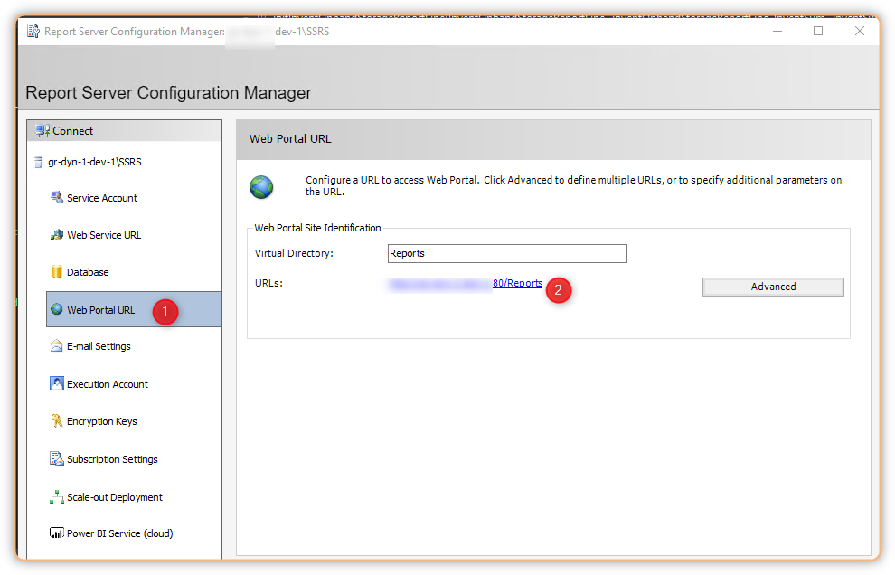

# How to remove SSRS reports in FinOps Cloud-Hosted


There are 2 ways that you can delete SSRS reports in FinOps cloud-Hosted

## 1. Using Report server configuiration manager web portal

Open Report server configuiration manager from your VM FinOps Cloud-Hosted and active the **Web Portal**



You can delete any report from `[Servername]/Reports/browse/Dynamics`


## 1. Using Powershell script

Go to `RemoveAllReportsFromSsrs.ps1` under `K:\AosService\PackagesLocalDirectory\Plugins\AxReportVmRoleStartupTask`

Run the script to remove all SSRS report.

If you want to remove a specific report, you can manipulate the $ReportName

```powershell
################################################################################
# This script is used to manually remove reports to SSRS server
################################################################################
param
(
    [Parameter(Mandatory=$false)]
    [string]$LogFilePath,
    [Alias("ReportServerFqdn", "ReportServerName")]
    [Parameter(Mandatory=$false)]
    [string[]]$ReportServerIp = "127.0.0.1",
    [Parameter(Mandatory=$false)]
	[string[]]$ReportName = "[report-name].[design-name]",
    [Parameter(Mandatory=$false)]
	[switch]$UseHttps = $false,
    [Parameter(Mandatory=$false)]
	[int]$HttpsPort = 443,
    [Parameter(Mandatory=$false)]
    [switch]$Help = $false
)
```

Check [this article](/2021-01-27-deploy-ssrs-reports-in-dynamics-365-finance-scm-using-powershell/) for deploy report using PS script.
