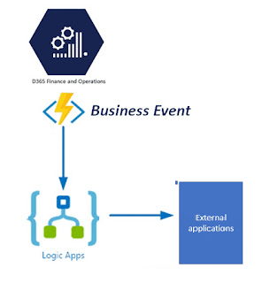
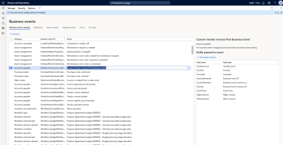

# Developing business events with x++ from scratch


Business events provide a mechanism that allow external system receives notifications from Microsoft Dynamics 365 Finance and operations. 
or example – When you are posting a purchase invoice then you can send notifications/ payload / message to an external system.

You can use existing standard business events which are available in the D365 FO or you can also develop and customize new business events as per your need.



There are 2 ways you can consume business events:

1. Power automate (Microsoft Flow)
2. Azure messaging services.

## Scenario

In this example, I am going to show you how we can develop a new custom business event from scratch. In my scenario, business event in D365 FO should be triggered when a user is posting purchase invoice in Microsoft dynamics 365 for finance and operations.

There a 2 standard and base classes which i will use to develop custom business events

* `BusinessEventsContract` ( Use for developing/defining payload message)
* `BusinessEventsBase` ( Use for triggering custom business event)

Create a `PAAPurchInvoiceJournalPostBusinessEventContract` class

```c#
[DataContract]
class PAAPurchInvoiceJournalPostBusinessEventContract extends BusinessEventsContract
{
    private VendAccount vendAccount;
    private PurchId purchid;
    private InvoiceId invoiceId;

    private void initialize(VendInvoiceJour _vendInvoiceJour)
    {
        vendAccount = _vendInvoiceJour.OrderAccount;
        purchid = _vendInvoiceJour.PurchId;
        invoiceId = _vendInvoiceJour.InvoiceId;
    }

    public static PAAPurchInvoiceJournalPostBusinessEventContract newFromVendInvoiceJour(VendInvoiceJour _vendInvoiceJour)
    {
        PAAPurchInvoiceJournalPostBusinessEventContract contract = new PAAPurchInvoiceJournalPostBusinessEventContract();
        contract.initialize(_vendInvoiceJour);
        return contract;
    }

    private void new()
    {
    }

    [DataMember(‘VendAccount’), BusinessEventsDataMember(‘VendAccount’)]
    public vendAccount parmvendAccount(vendAccount _vendAccount = vendAccount)
    {
        vendAccount = _vendAccount;
        return vendAccount;
    }

    [DataMember(‘PurchId’), BusinessEventsDataMember(“PurchId”)]
    public PurchId parmPurchId(PurchId _purchId = purchId)
    {
        purchId = _purchId;
        return purchId;
    }

    [DataMember(‘InvoiceId’), BusinessEventsDataMember(“InvoiceId”)]
    public InvoiceId parmInvoiceId(InvoiceId _invoiceId = invoiceId)
    {
        invoiceId = _invoiceId;
        return invoiceId;
    }
}
```

Create a `PAAPurchInvoiceJournalPostBusinessEvent` class

```c#
[BusinessEvents(classStr(PAAPurchInvoiceJournalPostBusinessEventContract),
                "Custom Vendor Invoice Post Business Event",
                "This business event is triggering during the time purchase invoice posting",
                ModuleAxapta::AccountsPayable)]

class PAAPurchInvoiceJournalPostBusinessEvent extends BusinessEventsBase
{
    private VendInvoiceJour vendInvoiceJour;

    static public PAAPurchInvoiceJournalPostBusinessEvent newFromVendInvoiceJour(VendInvoiceJour _vendInvoiceJour)
    {
        PAAPurchInvoiceJournalPostBusinessEvent businessEvent = new PAAPurchInvoiceJournalPostBusinessEvent();

        businessEvent.parmVendInvoiceJour(_vendInvoiceJour);
        return businessEvent;
    }

    private VendInvoiceJour parmVendInvoiceJour(VendInvoiceJour _vendInvoiceJour = vendInvoiceJour)
    {
        vendInvoiceJour = _vendInvoiceJour;
        return vendInvoiceJour;
    }

    private void new()
    {
    }

    [Wrappable(true), Replaceable(true)]
    public BusinessEventsContract buildContract()
    {
        return PAAPurchInvoiceJournalPostBusinessEventContract::newFromVendInvoiceJour(vendInvoiceJour);
    }
}
```

You must add below block of code in purchase invoice posting routine class. Also business must be activated or enabled in that company. Business event will trigger when purchase invoice posting will take place.

```c#
VendInvoiceJour vendInvoiceJour = this; // vendInvoiceJour buffer

if(BusinessEventsConfigurationReader::isBusinessEventEnabled(classStr(PAAPurchInvoiceJournalPostBusinessEvent)))
{
    PAAPurchInvoiceJournalPostBusinessEvent::newFromVendInvoiceJour(this).send () ;
}
```

Build your project solution and navigate to path `[System administration–> Setup –> Business Events –> Business Events Catalog]` to see and activate your business event.


